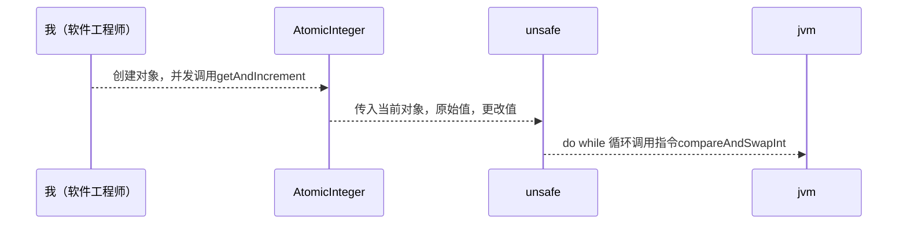

*  目录
{:toc}


concurrent-AtomicInteger线程同步




#### compareAndSwapInt 这个原子操作的指令实现

```
c/c++ 加上硬件支持的
```


```
public class AtomicTest {
    AtomicInteger atomicInteger = new AtomicInteger(0);
    static ExecutorService executorService = Executors.newFixedThreadPool(10);

    public static void main(String[] args) {
        AtomicTest atomicTest = new AtomicTest();
        for (int i = 0; i < 1000; i++) {
            executorService.submit(new Runnable() {
                @Override
                public void run() {

                    //getAndIncrement() 这个函数怎么实现线程同步的
                    atomicTest.atomicInteger.getAndIncrement();
                    System.out.println(atomicTest.atomicInteger.get());
                }
            });

        }
    }

}
```


### getAndIncrement

```
   public final int getAndIncrement() {
        return unsafe.getAndAddInt(this, valueOffset, 1);
    }
```

#### this 当前AtomicInteger对象

#### valueOffset 是获取AtomicInteger对象的value通过反射

```
 private static final long valueOffset;

    static {
        try {
            valueOffset = unsafe.objectFieldOffset
                (AtomicInteger.class.getDeclaredField("value"));
        } catch (Exception ex) { throw new Error(ex); }
    }

    private volatile int value;
```


### unsafe class

#### 通过native 方法compareAndSwapInt 比较并交换 do while

```
   public final int getAndAddInt(Object var1, long var2, int var4) {
        int var5;
        do {
            var5 = this.getIntVolatile(var1, var2);
        } while(!this.compareAndSwapInt(var1, var2, var5, var5 + var4));

        return var5;
    }
```


