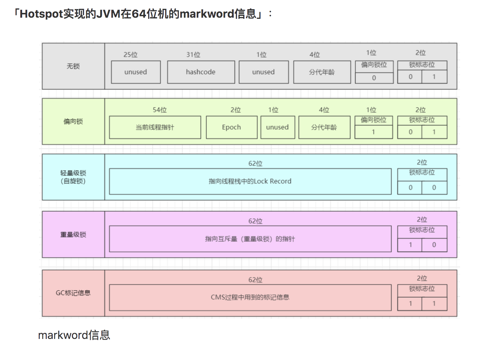
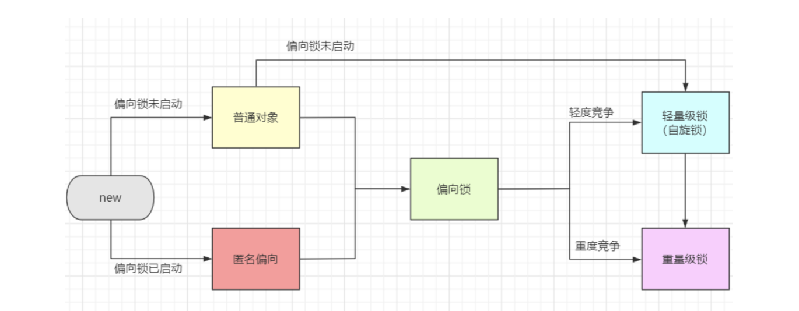

[TOC]

### Java基础

##### LinkedList

```
双向链表
```

##### java序列化

##### Iterator的特点

```
安全，因为它可以确保，在当前遍历的集合元素被更改的时候，就会抛出 ConcurrentModificationException 异常。
```

##### final关键字的理解

```
功能:
    修饰类-表示不可继承即不可修改  
    字段表示不可修改  ：基础类型不可变，引用类型不能保证
    修饰方法入参 表示在方法内参不能修改
    
原理：
```

```
 final StringBuilder sb = new StringBuilder("Java");
    sb.append("Script");
    System.out.println(sb);  //resultJavaScript
```

##### 锁相关

##### volitile

```
1 作用: 
  1 防止编译器重排序  
  2 实现高速缓存的可见性 ->单例模式DCL双重检测加锁
  3 保证单次读写的原子性,JLS 因为long和double两种数据类型的操作可分为高32位和低32位两部分，因此普通的long或double类型读/写可能不是原子的
```

##### JLS协议

##### happen-before

```
翻译过来为： jsr-133
同一个线程中的，前面的操作 happen-before 后续的操作。（即单线程内按代码顺序执行。但是，在不影响在单线程环境执行结果的前提下，编译器和处理器可以进行重排序，这是合法的。换句话说，这一是规则无法保证编译重排和指令重排）。
监视器上的解锁操作 happen-before 其后续的加锁操作。（Synchronized 规则）
对volatile变量的写操作 happen-before 后续的读操作。（volatile 规则）✅
线程的start() 方法 happen-before 该线程所有的后续操作。（线程启动规则）
线程所有的操作 happen-before 其他线程在该线程上调用 join 返回成功后的操作。
如果 a happen-before b，b happen-before c，则a happen-before c（传递性）。
```

##### 内存屏障

```
目的：实现可见性 和happen-before语义
```


##### synchronized

```
2 作用场景：1 实例方法，锁住实例对象，2 静态方法，锁住class 对象，即所有对象 3 代码块，锁给定的对象
3 原理实现  1 jvm 指令 enter exit+java头对象markword 
4 优缺点  不可尝试，非公平，不可中断，异常自动释放，性能跟资源竞争程度成正比
```

锁升级

```
new -> 「偏向锁」 -> 「轻量级锁 （自旋锁）」-> 「重量级锁」

默认情况，偏向锁有个时延，默认是4秒
why? 因为JVM虚拟机自己有一些默认启动的线程，里面有好多sync代码，这些sync代码启动时就知道肯定会有竞争，如果使用偏向锁，就会造成偏向锁不断的进行锁撤销和锁升级的操作，效率较低。
可以用BiasedLockingStartupDelay参数设置是否启动偏向锁（=0，立即启动偏向锁）：

-XX:BiasedLockingStartupDelay=0

JDK1.6中-XX:+UseSpinning开启； -XX:PreBlockSpin=10 为自旋次数； JDK1.7后，去掉此参数，由jvm控制。

「重量级锁」-依赖于底层操作系统的Mutex Lock
```






##### sync&&lock的区别

| 实现方式                              |      | 是否可尝试 | 是否可重入 | 公平/非公平 | 是否可中断 | 异常是否                              | 资源竞争不激烈 | 资源竞争激烈 |
| ------------------------------------- | ---- | ---------- | ---------- | ----------- | ---------- | ------------------------------------- | -------------- | ------------ |
| 通过AQS实现 基于接口                  | lock | 是         | 是         | 是          | 是         | 因此使用Lock时需要在finally块中释放锁 |                | 常态         |
| 基于对象内存空间  enter/exit实现 内置 | sync | 否         | 是         | 否          | 否         | 自动释放                              | 稍差           | 特差         |

##### sync

### 并发包

##### 线程

```
状态 ready blocked running

create thread runnable

停止 1 通过标志  2 stop强行停止 3 innterrupt中断

sleep和wait的区别： 都是进入blocked 状态，sleep不释放锁
sleep 和yield的区别
	1 sleep 让出cpu是会不考虑优先级 ，yield 只会给优先级>=的线程
	2 sleep 进入blocked， yield 进入ready状态
	3 sleep 会抛出一个中断异常， yield的没有
	
notify() 和 notifyAll()的区别 ；notify只唤醒一个线程，notifyAll唤醒监视器上的等待的所有线程

Thread.holdsLock(test); 检测当前线程是否持有某锁

```


##### java线程调度算法

```
线程调度方式：
	抢占式:
	协同式:
java是根据线程优先级的抢占式
```


##### 线程池

```
线程池
1 创建：ThreadPoolExecutor 使用这个创建而不是Executors，因为允许队列或线程的最大值Integer.MAX_VALUE oom
2 参数：
核心线程数：最小可同时运行的线程
最大线程数：当队列满了，可同时运行的最大线程
工作队列：存放任务的队列

`keepAliveTime`：线程数量》coreSize ，没有新任务提交，keepAliveTime时间后，销毁线程

饱和策略 ：拒绝新任务，调用执行自己的线程执行新任务，丢弃最早的任务

提交任务 1 核心线程 2 队列 3 最大线程数 4 饱和策略

1 `Runnable` &&Callable  Callable 是升级版 有返回值，可抛异常
2 execute &&submit  submit 是升级版，可以获取到线程执行的结果

join、yeild作用 ✅   yeild 让出cpu调度，让出后可能再次执行 4.join：一种特殊的wait，当前运行线程调用另一个线程的join方法，当前线程进入阻塞状态直到另一个线程运行结束等待该线程终止。 注意该方法也需要捕捉异常。
```

##### 线程同步类

```
1 Semaphore(信号量)：信号量控制的是线程并发的数量。
2 CountDownLatch  线程同步类 是一组线程
3 **CyclicBarrier 线程同步类

threadlocal
功能：实现每个线程都有自己的变量
原理：threadlocalmap存放 线程-obj
内存泄露问题：key存放的是弱引用，会内存回收掉，key会变成null。解决办法->在不用时调用remove方法

2、问了父子线程怎么共享数据 interitableThreadLocal
```


nacos

### java框架

##### ioc  控制翻转

##### di依赖注入

