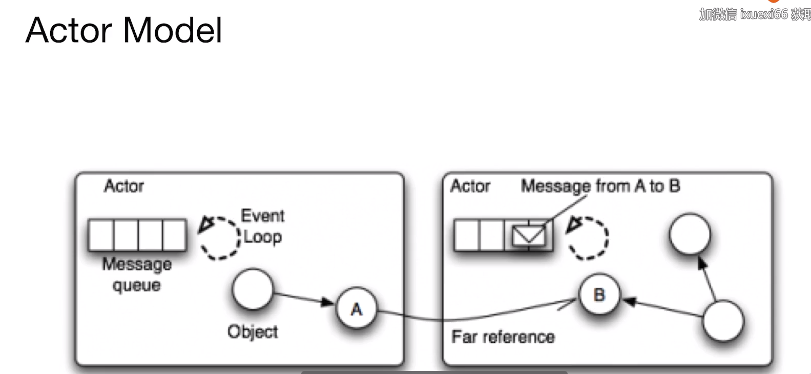

*  目录
{:toc}

go 语言基础

##### 1 go出生的目的

```
<li>多核硬件架构；</li>
<li>超大规模分布式计算集群；</li>
<li>Web 开发模式导致的前所未有的开发规模和更新速度。</li>
```

##### go的特性

```
<p>简单：较之 C 语言的 37 个关键字和 C++ 11 的 84 个关键字，Go 只有 25 个关键字；特别是对于一些复杂编程任务如：并发编程，内存管理，Go 语言有内置的并发支持及垃圾回收机制。</p>
<p>高效：Go 是编译的静态类型语言，尽管支持了垃圾回收，但GO中仍可以通过指针进行直接内存访问。</p>
<p>生产力：Go语言有简单清晰的依赖管理，简洁的语法，以及独特的接口类型，甚至是一些编程方式的约束，如支持复合而不是继承的扩展方式，这些特性使得它成为一门极具生产力的语言。</p>
```


go

```
1 大量使用共享内存的方式进行并发控制，而忽略了 Go 内置的 CSP  并发机制；
2 Java 程序员在编写Go程序喜欢在方法调用间直接传递数组，导致大量内存复制。其实，与 Java 不同，Go 的数组参数是通过值复制来传递的。
3 Java 程序员用Go时也总是喜欢创建一个只包含接口定义的包，以处理依赖关系。而 这Go 中其实大可不必，在 Go 中接口的实现对接口定义是没有依赖的。
```

go知识点

##### 第一节 hello world

```
1 程序的入口 包名必须是main,方法名必须是main ,文件名不一定要是main.go
2 main  方法不支持返回值，通过os.exit(1)通过函数，来设置返回值
3 main 函数不支持参数，通过os.args() 函数来接受参数
```

##### 2变量和常量

```
1 测试类以_test结尾，测试方法以Test开头
2 定义未使用，则编译报错
3 := 使用类型推断，同时定义多个变量
4 使用t.log在测试加日志
5 变量交换，a,b=b,a 不需要中间变量
6 通过连续常量的赋值 iota 
```

##### 3 数据类型

```
bool
string 
int int8 int16 int32 int64   
uint uint8 uint16 uint32 uint64 uintptr
byte //alias for uint8
rune //alias for int32  represents a Unicode code point   发音 roon
float32 floar64
complex64 complex128 复数类型 

1 go不支持隐士类型转换，原类型和别名类型也不支持
2 go 不支持指针运算 
3 string是值类型，其默认的初始化值为空字符串，而不是nil
```

##### 4 运算符

```
1 go 不支持前置++ (java有前置++和后置++)
2 相同维数且含有相同个数元素的数组才可以比较
3 每个元素都相同才相等
4&^ 按位清零，
```

##### 5 条件和循环

```
1 if支持2段逻辑，第一段可以支持调方法/初始变量，第二段位判断
2 go switch 不需要break。case:后面可以if的条件表达式，case后面支持多个项
```


##### 6 数组和切片

```
数组的遍历
1 idx,e:=range array //idx是下标，e是值
2 数组的截取arr[i:j]表示截取第i个元素到到第j-1个元素。

切片
var s0 [] int 
s1:=[]int{1,2,3,4}
s2:=make([]int ,3,5)
切片的增长扩容规则:
切片的增长位2的指数增长，只要大于2的n次，则n+1
```

##### 7 map

```
map的初始化
m:=map[string] int {"ine ":1,"two":2,"three":3}
M1:=map[string] int {}
M1["one"]=1
m2:=make(map[string]int ,10 //初始化容量)

map
在访问的key不存在时，仍然会返回0值，不能通过返回nil来判断元素是否存在，需要通过err参数。

遍历
k,v :=range map 

map的value可以是个方法
m:=map[int]func(op int) int {}

与go的dock type接口方式一起，可以方便的实现单一方法对象的工厂模式

go语言没有set，可以同map实现set特性
```

##### 8 字符串

```
1 string是数据类型，不是引用或指针类型
2 string 是只读的byte slice，len函数可以包含它所包含的byte函数
3 string 的byte数组可以存放任何数据

1 Unicode 是一种字符集
2 UTF8是unicode的存储实现（转换为字节序列的规则）
```

##### 9 函数

```
1 可以有多个返回值
2 所有参数都是值传递，slice，map，channel会有传引用的错觉
3 函数可以作为变量的值
4 函数可以作为参数和返回值

计时&& 函数氏编程
func timeSpent(inner func(op int) int) func(n int) int {
	return func(n int) int {
		start := time.Now()
		ret := inner(n)
		fmt.Print("time spent:", time.Since(start).Seconds())
		return ret
	}
}
```


##### 10 可变参数&&defer

```
可变参数  多个参数... int 
defer 延迟运行，即在方法的最后一行运行
```


##### 11 行为的定义和实现

```
func (u user)addUser(){} //通过引用调用 这种方式在调用会时会复制值 调用效率低
func (u *user)addUser(){}//通过指针调用  这种方式在调用会时不会复制值 调用效率高


```

##### 12 go语言相关接口

```
1 go 没有继承，go实现不依赖接口定义
```


##### 13扩展&&复用

```

```

##### 14 接口&&多态

```
1 空接口可以表示任何类型
2 通过断言来将空接口转换车为制定类型
v,ok:=p.(int) //ok=true 时为转换成功


最佳接口实践
1 使用小的接口定义，很多接口只包含一个方法
2 较大的接口定义，可以由多个小接口定义组合而成
3 只依赖必要功能的最小接口
```

##### 15 编写好的错误处理

```
1 没有异常机制
2 error类型实现了error接口
3 可以通过eerrors.New 来快速创建错误实例
```


##### 16 panic &&recover

```
1 panic 用于不可恢复的错误
2 panic 退出前会执行defer指定的内容

os.exit 退出时不会的调用defer指定的函数
os.exit 退出时不输出当前调用栈信息


最常见的错误恢复
defer func(){
	if err:=recover();err!=nil{
		log.Error("recoverd panic",err)
	}
}()

当心 recover 成为恶魔
形成僵尸服务进程，导致health check 失效
let it carsh 往往是我们恢复不确定性错误的最好办法

```


##### 17 可服用模块包

```
1 基本服用模块单元 
	以首字母大写来表明可被包外代码访问
2 代码的package 可以和所在的目录不一致
3 同一目录里的go代码的package要保持一致

package init 方法
1 在main被执行之前，所有依赖的package 的int方法都会被执行
2 不同包的init函数按照包倒入的依赖关系决定执行顺序
3 每个包可以包含多个init函数
4 包的每个源文件也可以有多个init函数，这点比较特殊

1 通过go get 来获取远程依赖
	 go get -u 强制从网络更新远程依赖
2 注意代码在github 上的组织形式，以适应go get 
	直接以代码路径开始 不要有src
```

##### 18 go的依赖管理

```
 go 未解决的问题
 1 同一环境下，不用项目使用同一包的不同版本
 2 无法管理对包的特定版本依赖 
 
vendor路径
1 当前包下的vendor目录
2 向上级目录查找。直到找到src下的vendor目录
3 在gopath下面查找依赖包
4 在goroot目录下查找

常用的依赖管理工具
godep
glide
dep

go不支持循环依赖
```


##### 19 go的协程与线程区别

```
thrad&&Groutime
1创建时默认栈大小
	jdk5后默认是1m
	g	o的栈默认是2k
2 和KSE的 kernel space entity 对应关系--关系到系统调度效率
	java thread 1:1
	go M:N,
```

##### 20 共享内存并发机制

```
锁 sync.Mutex 读写锁
WaitGroup  

go读写共享变量 - 1 mutex 2 channel 3 原子性操作 
```


##### 21csp 通道

什么是csp 通过通信共享内存  

```
csp:通信顺序过程（communicating sequential processes，CSP）是一种描述并发系统中交互模式的正式语言

特点 
1 用户空间 避免了内核态和用户态的切换导致的成本.
2 可以由语言和框架层进行调度.
3 更小的栈空间允许创建大量的实例.


```

Actor Model



```
csp 通过通道协调

csp&&Actor的区别
	 1 和Actor的直接通讯不同，CSP模式则是通过Channel进行通讯的，更松耦合一些
	 2 go中的channel是有容量限制并且独立于处理Groutine，而如Erlang，Actor模式中的mailbox容量是无限的，接受进程也总是被动地处理消息

channel 的2种模式
	1 channel 只能存放一个消息，生产者等待的额条件是消费者没有消费，消费这等待的条件是，生成这没有生成
	2 buffer channel 有容量的通道，生成这的等待的条件是容量满了，消费这等待的条件是容量为空
```


##### 22 多路选择和超时

```
select 

case case执行的顺序不是程序的上下顺序
```

##### 23 通道的关闭/广播

```
1 向关闭的通道发送数据，会导致panic
2 v,ok<-ch;ok为bool值，true表示正常接受，flase表示通道关闭
3 所有的channel接受者都会在channel关闭时，立刻阻塞等待中返回且上述ok值为false。这个广播机制常被被利用，进行向多个订阅者同时发送信号。如 退出信号
```


##### 25 任务的取消

```
context和任务的取消

关联任务的取消
1 context
 根context，通过context。backgroud 创建
 子context: context.withCancel(parentContext)创建
 	ctx，cancel:=context.withCancel(context.BackGround())
 	当前Context 被取消时，基于其他的子context都会被取消
 接受取消的通知，<-ctx.Done

```

##### 26 只运行一次

```
单例模式
 var one sync.Once 通过once的Do方法，只会被执行一次
 var obj *SingletonObj
 
 func GetSingletonObj ()*SingletonObj{
 one.Do(fun)(){
}
 }
```


##### 27  并发执行多个任务，当任意一一个任务返回，则返回

```
通过buffer channel实现，只用channel会存在协程泄漏
```

##### 28 所有任务都返回

```
通过buffer channel
```


##### 29 对象池

```
通过buffer channel实现
不建议在同一个对象池中存放不同对象
```


##### 30 sync.Pool 对象缓存

```
1 尝试从过年私有对象获取
2 私有对象不存在，尝试从当前processor的共享池中
```

##### 31 单元测试

```
error 程序会继续执行
failNow 程序会立即终止

go test -v -cover 测试代码覆盖率

断言：github stretchr/testtify
```


##### 32 性能测试

```
以Benchmark 开头

运行时，go test -bench=. -benchmem 
//.表示运行当前下所有的test benchmem是会输出更多的性能参数
```


##### 33 BDD

```
验证测试用例的框架
```


##### 34  反射编程

```
reflect。TypeOf -返回类型
reflect。ValueOf 返回值
可以从reflect.Value 获得类型
通过kind的来判断类型

利用反射编写灵活的代码

按名字访问结构成员
reflect.ValueOf(*e).FiledByName("Name")
按 名字访问结构的方法
reflect。Valueof(e).MethodByName("UpdateAge").call([]reflect.Value{reflect.ValueOf)(1)})
```


##### 35 万能程序

```
1 通过反射比较切片和map reflect。DeepEqual()

e:=new(User)
err:=json.Unmarshal([]byte(jsonStr),e)
err!=nil  t.error(err)

fmt.pring(*e)

json.Marshal()


```


##### 36 不安全编程

```
go 语言不支持强制类型转换

用不安全
i：=10
发：=*（*int）（unsafe.Pointer(&i)）

atomic
```

##### 37 架构模式


##### 38 内置json解析--配置解析

```
1 feildTag 通过反射解析json
2 
```


##### 39 高效解析json--easyJson包

```
1 会在本地生成json代码。
2 然后进行转换
```


##### 40 构建restful服务

```
第三方包 httpRouter
```

##### 41 性能分析工具

```
graphviz
go-torch

go tool pprof prof +文件 //查看性能测试的文件

配置环境变量
export GOPATH=/Users/romeo/songguo/myGoTest
```


##### 42 性能调优实例

```
1 设定有化目标
2 分析系统瓶颈
3 优化瓶颈

常见的指标
wall tme 
cpu time
block time
memory allocation
GCTime/Time spent
```


##### 43 别让性能被锁住

```
go中也有模仿java的currentMap

减少锁的影响范围
减少发生锁冲突的概率
syn.map--读多写少
concurrentMap --写多读少

避免所得使用--避免使用说的工具
lamx disruptor--避免使用说的工具
```


##### 44 GC 友好的代码

```
避免内存分配和复制
	初始化至何合适的内存大小
复杂对象尽量使用传递引用
打开GC日志
1 只要在程序执行之前加上环境变量 GODEBUG=gctrace=1
2 使用go trace 
```


##### 45 字符串连接

```
1 通过stringBuilder 性能第二
2 通过+来拼接
3 通过byte buffer 性能第一
```


##### 46 面向错误的设计

```
1 隔离错误
2 断路器原理
```

##### 47 面向恢复的设计

```
健康检查
1 注意僵尸进程
	1 池化资源耗尽
	2 死锁
```


48 相关开源项目 

```
chaosmonkey
easierway
```

