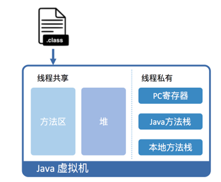
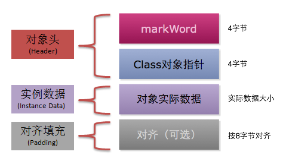
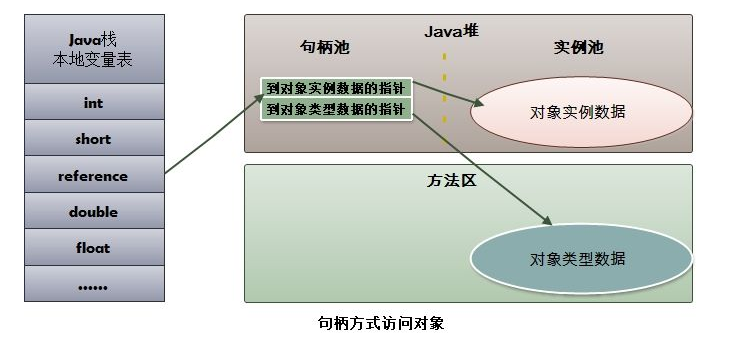
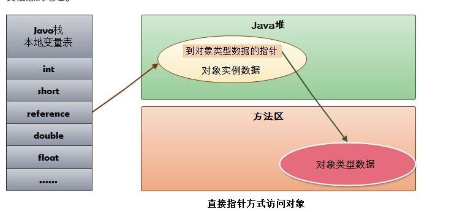

[TOC]


### 1 jvm内存结构

```
参考资料 https://github.com/doocs/jvm
```

##### java代码的运行

```
运行方式：双击jar 命令中运行 网页中 
运行环境 jre，jre包括jvm java核心类库。
运行过程：
```

##### 类的加载过程

```
1 加载，分三步，1 根据包名+类名加载文件二进制文件 2 存储在方法区 3 生成类的class实例
2 验证  文件格式 元数据 字节码 符号引用
3 准备 为静态变量分配内存并设置0值，
4 解析 
5 初始化
```

##### jvm常量池

```
JDK 1.8 开始
**1、** 字符串常量池：存放在堆中，包括 String 对象执行 intern() 方法后存的地方、双引号直接引用的字符串
**2、** 运行时常量池：存放在方法区，属于元空间，是类加载后的一些存储区域，大多数是类中 constant_pool 的内容
**3、** 类文件常量池：constant_pool，JVM 定义的概念
```

##### jvm内存结构



```
方法区
堆
程序计数器 
	作用 记录当前线程执行的位置
	特点:唯一不会发生OutOfMemoryError的区域
java 方法栈
	特点：StackOverFlowError，OutOfMemoryError。是否允许动态扩展，栈深度异常-->StackOverFlowError,内存问题-
 本地方法栈(C栈)
```

https://github.com/doocs/jvm/blob/main/docs/01-jvm-memory-structure.md

##### 堆 

```
堆可以分为Eden区, from Survior ，to Survivor 老年代

新生代和老年代
	1 新生代：老年代默认1:2, JVM 调参数，XX:NewRatio=2
	2 Eden 空间和另外两个 Survivor 空间缺省所占的比例是：8:1:1
```

##### 对象分配过程

```
new 的对象先放在 Eden 区，大小有限制
如果创建新对象时，Eden 空间填满了，就会触发 Minor GC，将 Eden 不再被其他对象引用的对象进行销毁，再加载新的对象放到 Eden 区，特别注意的是 Survivor 区满了是不会触发 Minor GC 的，而是 Eden 空间填满了，Minor GC 才顺便清理 Survivor 区
将 Eden 中剩余的对象移到 Survivor0 区
再次触发垃圾回收，此时上次 Survivor 下来的，放在 Survivor0 区的，如果没有回收，就会放到 Survivor1 区
再次经历垃圾回收，又会将幸存者重新放回 Survivor0 区，依次类推
默认是 15 次的循环，超过 15 次，则会将幸存者区幸存下来的转去老年区 jvm 参数设置次数 : -XX:MaxTenuringThreshold=N 进行设置
频繁在新生区收集，很少在养老区收集，几乎不在永久区/元空间搜集
```

#####  逃逸分析

```
当一个对象在方法中被定义后，它可能被外部方法所引用，如作为调用参数传递到其他地方中，称为方法逃逸
再如赋值给类变量或可以在其他线程中访问的实例变量，称为线程逃逸

在编译期间，如果 JIT 经过逃逸分析，发现有些对象没有逃逸出方法，那么有可能堆内存分配会被优化成栈内存分配。
jvm 参数设置，-XX:+DoEscapeAnalysis ：开启逃逸分析 ，-XX:-DoEscapeAnalysis ： 关闭逃逸分析
从 jdk 1.7 开始已经默认开始逃逸分析。
```


##### TLAB

```
TLAB 的全称是 Thread Local Allocation Buffer，即线程本地分配缓存区，是属于 Eden 区的，这是一个线程专用的内存分配区域，线程私有,默认开启的（当然也不是绝对的，也要看哪种类型的虚拟机）

堆上申请内存使用CAS,
-XX:+UseTLAB 使用 TLAB,-XX:+TLABSize 设置 TLAB 大小
```

##### 四种引用方式

```
- 强引用：创建一个对象并把这个对象赋给一个引用变量 , 普通 new 出来对象的变量引用都是强引用，有引用变量指向时永远不会被垃圾回收，jvm 即使抛出 OOM，可以将引用赋值为 null，那么它所指向的对象就会被垃圾回收
- 软引用：如果一个对象具有软引用，内存空间足够，垃圾回收器就不会回收它，如果内存空间不足了，就会回收这些对象的内存。只要垃圾回收器没有回收它，该对象就可以被程序使用
- 弱引用：非必需对象，当 JVM 进行垃圾回收时，无论内存是否充足，都会回收被弱引用关联的对象。
- 虚引用：虚引用并不会决定对象的生命周期，如果一个对象仅持有虚引用，那么它就和没有任何引用一样，在任何时候都可能被垃圾回收器回收。
```

##### 方法区

```
存放：已经被虚拟机加载的类信息 常量 静态变量 即时编译器编译后的代码
特点：线程共享 永久代 内存回收效率低
```


##### 直接内存

```
定义:java虚拟机内存之外的内存
应用：NIO通过 DirectByteBuffer对象直接操作该内存，而无须先将外部内存中的数据复制到堆中再进行操作，从而提高了数据操作的效率
```

##### 直接内存与堆内存比较

- 直接内存申请空间耗费更高的性能
- 直接内存读取 IO 的性能要优于普通的堆内存。
- 直接内存作用链： 本地 IO -> 直接内存 -> 本地 IO
- 堆内存作用链：本地 IO -> 直接内存 -> 非直接内存 -> 直接内存 -> 本地 IO

> 服务器管理员在配置虚拟机参数时，会根据实际内存设置`-Xmx`等参数信息，但经常忽略直接内存，使得各个内存区域总和大于物理内存限制，从而导致动态扩展时出现`OutOfMemoryError`异常。

##### 怎么看当前使用哪种垃圾收集器

```
-XX:+PrintCommandLineFlags 
通过gc日志
```

常见的jvm配置参数

```
Java 8 为例
**日志**
**1、** -XX:+PrintFlagsFinal，打印JVM所有参数的值
**2、** -XX:+PrintGC，打印GC信息
**3、** -XX:+PrintGCDetails，打印GC详细信息
**4、** -XX:+PrintGCTimeStamps，打印GC的时间戳
**5、** -Xloggc:filename，设置GC log文件的位置
**6、** -XX:+PrintTenuringDistribution，查看熬过收集后剩余对象的年龄分布信息
**内存设置**
**1、** -Xms，设置堆的初始化内存大小
**2、** -Xmx，设置堆的最大内存
**3、** -Xmn，设置新生代内存大小
**4、** -Xss，设置线程栈大小
**5、** -XX:NewRatio，新生代与老年代比值
**6、** -XX:SurvivorRatio，新生代中Eden区与两个Survivor区的比值，默认为8，即Eden:Survivor:Survivor=8:1:1
**7、** -XX:MaxTenuringThreshold，从年轻代到老年代，最大晋升年龄。CMS 下默认为 6，G1 下默认为 15
**8、** -XX:MetaspaceSize，设置元空间的大小，第一次超过将触发 GC
**9、** -XX:MaxMetaspaceSize，元空间最大值
**10、** -XX:MaxDirectMemorySize，用于设置直接内存的最大值，限制通过 DirectByteBuffer 申请的内存
**11、** -XX:ReservedCodeCacheSize，用于设置 JIT 编译后的代码存放区大小，如果观察到这个值有限制，可以适当调大，一般够用即可
**设置垃圾收集相关**
**1、** -XX:+UseSerialGC，设置串行收集器
**2、** -XX:+UseParallelGC，设置并行收集器
**3、** -XX:+UseConcMarkSweepGC，使用CMS收集器
**4、** -XX:ParallelGCThreads，设置Parallel GC的线程数
**5、** -XX:MaxGCPauseMillis，GC最大暂停时间 ms
**6、** -XX:+UseG1GC，使用G1垃圾收集器
**CMS 垃圾回收器相关**
**1、** -XX:+UseCMSInitiatingOccupancyOnly
**2、** -XX:CMSInitiatingOccupancyFraction，与前者配合使用，指定MajorGC的发生时机
**3、** -XX:+ExplicitGCInvokesConcurrent，代码调用 System.gc() 开始并行 FullGC，建议加上这个参数
**4、** -XX:+CMSScavengeBeforeRemark，表示开启或关闭在 CMS 重新标记阶段之前的清除（YGC）尝试，它可以降低 remark 时间，建议加上
**5、** -XX:+ParallelRefProcEnabled，可以用来并行处理 Reference，以加快处理速度，缩短耗时
**G1 垃圾回收器相关**
**1、** -XX:MaxGCPauseMillis，用于设置目标停顿时间，G1 会尽力达成
**2、** -XX:G1HeapRegionSize，用于设置小堆区大小，建议保持默认
**3、** -XX:InitiatingHeapOccupancyPercent，表示当整个堆内存使用达到一定比例（默认是 45%），并发标记阶段就会被启动
**4、** -XX:ConcGCThreads，表示并发垃圾收集器使用的线程数量，默认值随 JVM 运行的平台不同而变动，不建议修改
```

### 2 hotspot 虚拟机

##### 对象

```
对象头 :
  哈希码
  GC 分代年龄
  锁状态标志
  线程持有的锁
  偏向线程 ID
  偏向时间戳
  如果对象是一个数组，那么对象头还会包括数组长度
 实例数据 父类和本类的成员变量
 对齐数据 确保对象的总长度是8字节的倍数
```




##### 对象的创建过程

```
1 类加载 
2 分配
	指针碰撞：当内存比较规整，空闲内存和已使用内存中间放着一个指针作为分界点指示器，那么分配内存时只需要把指针向空闲内存挪动一段与对象大					小一样的距离，这种分配方式称为“指针碰撞”。
	空闲列表： Java 堆中内存并不规整，VM 必须维护一个列表，记录其中哪些内存块空闲可用。分配之时从空闲列表中找到一块足够大的内存空间划						分给对象实例。这种方式称为“空闲列表”。
3 初始化 1成员变量初值，设置对象头信息，调用构造函数初始化
```

##### 对象的访问方式

```
内存分配  对象的存储空间都是在堆中分配的，对象的引用却是在堆栈中分配的

句柄访问方式
直接指针访问方式
区别
HotSpot 采用第二种方式，即直接指针方式来访问对象，只需要一次寻址操作，所以在性能上比句柄访问方式快一倍。但像上面所说，它需要额外的策略来存储对象在方法区中类信息的地址。
```






### 3 垃圾策略和算法

```
1 关注的对象：堆+方法区
```

##### 判断对象是否存活

```
引用计数器;对象头的count计算引用次数，Recycler算法解决循环引用，多线程环境，同步性能低
可达性分析
	所有和 GC Roots 直接或间接关联的对象都是有效对象，和 GC Roots 没有关联的对象就是无效对象。
    GC Roots 是指：

    Java 虚拟机栈（栈帧中的本地变量表）中引用的对象
    本地方法栈中引用的对象
    方法区中常量引用的对象
    方法区中类静态属性引用的对象

    GC Roots 并不包括堆中对象所引用的对象，这样就不会有循环引用的问题。
```


##### 引用的种类

```
强引用（Strong Reference）
类似 "Object obj = new Object()" 这类的引用，就是强引用，只要强引用存在，垃圾收集器永远不会回收被引用的对象。但是，如果我们错误地保持了强引用，比如：赋值给了 static 变量，那么对象在很长一段时间内不会被回收，会产生内存泄漏。

软引用（Soft Reference）
软引用是一种相对强引用弱化一些的引用，可以让对象豁免一些垃圾收集，只有当 JVM 认为内存不足时，才会去试图回收软引用指向的对象。JVM 会确保在抛出 OutOfMemoryError 之前，清理软引用指向的对象。软引用通常用来实现内存敏感的缓存，如果还有空闲内存，就可以暂时保留缓存，当内存不足时清理掉，这样就保证了使用缓存的同时，不会耗尽内存。

弱引用（Weak Reference）
弱引用的强度比软引用更弱一些。当 JVM 进行垃圾回收时，无论内存是否充足，都会回收只被弱引用关联的对象。

虚引用（Phantom Reference）
虚引用也称幽灵引用或者幻影引用，它是最弱的一种引用关系。一个对象是否有虚引用的存在，完全不会对其生存时间构成影响。它仅仅是提供了一种确保对象被 finalize 以后，做某些事情的机制，比如，通常用来做所谓的 Post-Mortem 清理机制。
```

##### 回收方法区内存

```
废弃常量
	判定方式 不被引用
无用的类
	该类的所有对象都已经被清除
  加载该类的 ClassLoader 已经被回收
  该类的 java.lang.Class 对象没有在任何地方被引用，无法在任何地方通过反射访问该类的方法。
  
  一个类被虚拟机加载进方法区，那么在堆中就会有一个代表该类的对象：java.lang.Class。这个对象在类被加载进方法区时创建，在方法区该类被删除时清除。
```

##### 垃圾收集算法

```
标记-清除
	过程:使用可达性分析标记，清除
	不足：效率问题，标记和清除2个动作效率低;空间问题:碎片
	
复制算法(新生代)
	过程：把内存分为2块，将存货对象复制到另一块，然后清除所有对象。
	优缺点：不会又碎片，但是空间利用率为50%

改进 新生代的内存结构，Eden、From Survivor、To Survivor，比例是 8:1:1，每次使用 Eden 和其中一块 Survivor。回收时，将 Eden 和 Survivor 中还存活的对象一次性复制到另外一块 Survivor 空间上，最后清理掉 Eden 和刚才使用的 Survivor 空间。这样只有 10% 的内存被浪费。

问题:不能保证回收的只有10%对象，需要依赖老年代进行分配担保

分配担保
为对象分配内存空间时，如果 Eden+Survivor 中空闲区域无法装下该对象，会触发 MinorGC 进行垃圾收集。但如果 Minor GC 过后依然有超过 10% 的对象存活，这样存活的对象直接通过分配担保机制进入老年代，然后再将新对象存入 Eden 区。


分代收集
新生代：复制算法
老年代：标记-清除算法、标记-整理算法
```


### 4 hotSpot 垃圾收集器

##### 新生代垃圾收集器

```
Serial 垃圾收集器（单线程） gc时，应用程序会暂停
ParNew 垃圾收集器（多线程）也会有gc停顿

```

##### G1 通用垃圾收集器

```
定义  G1 是一款面向服务端应用的垃圾收集器，它没有新生代和老年代的概念，而是将堆划分为一块块独立的 Region （瑞警）。当要进行垃圾收集时，首先估计每个 Region 中垃圾的数量，每次都从垃圾回收价值最大的 Region 开始回收，因此可以获得最大的回收效率。


Remembered Set 每个Region 都有一个记录引用的set
 G1工作的过程
     初始标记：Stop The World，仅使用一条初始标记线程对所有与 GC Roots 直接关联的对象进行标记。
    并发标记：使用一条标记线程与用户线程并发执行。此过程进行可达性分析，速度很慢。
    最终标记：Stop The World，使用多条标记线程并发执行。
    筛选回收：回收废弃对象，此时也要 Stop The World，并使用多条筛选回收线程并发执行。
```

### 5 内存分配和回收策略

```
1 对象可能分配在栈 堆 年轻代 老年代上 取决于垃圾回收器的组合和相关参数配置
```

##### 大对象优先分配在Eden(E等)中

```
大多数情况下，对象在新生代 Eden 区中分配。当 Eden 区没有足够空间进行分配时，虚拟机将发起一次 Minor GC。
```

**Minor (ˈmaɪnər) GC** vs **Major(ˈmeɪdʒər) GC**/**Full GC**：

```
新生代：**Minor (ˈmaɪnər) GC
老年代：Major GC  比Minor的慢10倍以上 
```

> 在 JVM 规范中，Major GC 和 Full GC 都没有一个正式的定义，所以有人也简单地认为 Major GC 清理老年代，而 Full GC 清理整个内存堆。


##### 对象直接进入老年代情况

```
1  大对象直接进入老年代  因为大对象发生分配担保的概率很大，分配担保会导致效率低下
-XX:PretenureSizeThreshold 参数配置 大于这个配置称为大对象

2 新生代存活次数超过  XXMaxTenuringThreshold配置 ，进入老年代

3 动态对象年龄判断
	如果当前新生代的 Survivor 中，相同年龄所有对象大小的总和大于 Survivor 空间的一半，年龄 >= 该年龄的对象就可以直接进入老年代，无须等到 MaxTenuringThreshold 中要求的年龄。
```


##### 触发jvm full GC 条件

```
1 System.gc()  通过 DisableExplicitGC  参数禁止调用
2 老年代空间不足触发，如果触发后还不足，OutOfMemoryError Java heap space
3 永久代空间不足，方法区空间不足 full gc，触发后还是不足 -->OutOfMemoryError: PermGen space
4 CMS GC是出现promotion failed(担保失败) 和 concurrent mode failure(老年代空间不足)
5 统计得到的 Minor GC 晋升到旧生代的平均大小大于老年代的剩余空间
```

### 6  jvm性能调优

```
对内存如果是14g，full gc 长达十秒
```

##### 场景描述

```
一个小型系统，使用 32 位 JDK，4G 内存，测试期间发现服务端不定时抛出内存溢出异常。 加入 -XX:+HeapDumpOnOutOfMemoryError（添加这个参数后，堆内存溢出时就会输出异常日志）， 但再次发生内存溢出时，没有生成相关异常日志。
```

##### 分析

```
在 32 位 JDK 上，1.6G 分配给堆，还有一部分分配给 JVM 的其他内存，直接内存最大也只能在剩余的 0.4G 空间中分出一部分， 如果使用了 NIO，JVM 会在 JVM 内存之外分配内存空间，那么就要小心“直接内存”不足时发生内存溢出异常了=
```

##### 直接内存的回收过程

```
直接内存虽然不是 JVM 内存空间，但它的垃圾回收也由 JVM 负责。

垃圾收集进行时，虚拟机虽然会对直接内存进行回收， 但是直接内存却不能像新生代、老年代那样，发现空间不足了就通知收集器进行垃圾回收， 它只能等老年代满了后 Full GC，然后“顺便”帮它清理掉内存的废弃对象。 否则只能一直等到抛出内存溢出异常时，先 catch 掉，再在 catch 块里大喊 “`System.gc()`”。 要是虚拟机还是不听，那就只能眼睁睁看着堆中还有许多空闲内存，自己却不得不抛出内存溢出异常了。
```

### 7 类文件结构

```
Class 文件 中的所有内容被分为两种类型：无符号数、表。
Class 文件具体由以下几个构成:
    魔数
    版本信息
    常量池
    访问标志
    类索引、父类索引、接口索引集合
    字段表集合
    方法表集合
    属性表集合
```


### 8类加载时机

```
类的生命周期：
加载
验证
准备
解析
初始化
使用
卸载

```

##### 初始化规定

主动引用

```
在遇到 new、putstatic、getstatic、invokestatic 字节码指令时，如果类尚未初始化，则需要先触发其初始化。
对类进行反射调用时，如果类还没有初始化，则需要先触发其初始化。
初始化一个类时，如果其父类还没有初始化，则需要先初始化父类。
虚拟机启动时，用于需要指定一个包含 main() 方法的主类，虚拟机会先初始化这个主类。
当使用 JDK 1.7 的动态语言支持时，如果一个 java.lang.invoke.MethodHandle 实例最后的解析结果为 REF_getStatic、	
		REF_putStatic、REF_invokeStatic 的方法句柄，并且这个方法句柄所对应的类还没初始化，则需要先触发其初始化
```

被动引用


##### 接口的加载

```
接口加载过程与类加载过程稍有不同。

当一个类在初始化时，要求其父类全部都已经初始化过了，但是一个接口在初始化时，并不要求其父接口全部都完成了初始化，当真正用到父接口的时候才会初始化。
```

### 9 类加载过程

类加载过程包括 5 个阶段：加载、验证、准备、解析和初始化。

##### 加载的过程

- ```
  “加载”是“类加载”过程的一个阶段，不能混淆这两个名词。在加载阶段，虚拟机需要完成 3 件事：
  
  - 通过类的全限定名获取该类的二进制字节流。
  - 将二进制字节流所代表的静态结构转化为方法区的运行时数据结构。
  - 在内存中创建一个代表该类的 java.lang.Class 对象，作为方法区这个类的各种数据的访问入口。
  ```

  ##### 获取二进制字节流

  对于 Class 文件，虚拟机没有指明要从哪里获取、怎样获取。除了直接从编译好的 .class 文件中读取，还有以下几种方式：

  - 从 zip 包中读取，如 jar、war 等；
  - 从网络中获取，如 Applet；
  - 通过动态代理技术生成代理类的二进制字节流；
  - 由 JSP 文件生成对应的 Class 类；
  - 从数据库中读取，如 有些中间件服务器可以选择把程序安装到数据库中来完成程序代码在集群间的分发。


##### 验证的过程

- 文件格式验证 验证字节流是否符合 Class 文件格式的规范，并且能被当前版本的虚拟机处理，验证点如下：
  - 是否以魔数 0XCAFEBABE 开头。
  - 主次版本号是否在当前虚拟机处理范围内。
  - 常量池是否有不被支持的常量类型。
  - 指向常量的索引值是否指向了不存在的常量。
  - CONSTANT_Utf8_info 型的常量是否有不符合 UTF8 编码的数据。
  - ......
- 元数据验证 对字节码描述信息进行语义分析，确保其符合 Java 语法规范。
- 字节码验证 本阶段是验证过程中最复杂的一个阶段，是对方法体进行语义分析，保证方法在运行时不会出现危害虚拟机的事件。
- 符号引用验证 本阶段发生在解析阶段，确保解析正常执行。

##### 解析

解析阶段是虚拟机将常量池内的符号引用替换为直接引用的过程。

### 10 类加载器

##### 判断类是否相等 

```
这里的“相等”，包括代表类的 Class 对象的 equals() 方法、isInstance() 方法的返回结果，也包括使用 instanceof 关键字做对象所属关系判定等情况。
```

##### 双亲委派模型是啥 ？如何打破

```
1 打破案例 jdbc tomcat
```

##### 加载器种类

```
系统提供了 3 种类加载器：

启动类加载器（Bootstrap ClassLoader）： 负责将存放在 <JAVA_HOME>\lib 目录中的，并且能被虚拟机识别的（仅按照文件名识别，如 rt.jar，名字不符合的类库即使放在 lib 目录中也不会被加载）类库加载到虚拟机内存中。

扩展类加载器（Extension ClassLoader）： 负责加载 <JAVA_HOME>\lib\ext 目录中的所有类库，开发者可以直接使用扩展类加载器。

应用程序类加载器（Application ClassLoader）： 由于这个类加载器是 ClassLoader 中的 getSystemClassLoader() 方法的返回值，所以一般也称它为“系统类加载器”。它负责加载用户类路径（classpath）上所指定的类库，开发者可以直接使用这个类加载器，如果应用程序中没有自定义过自己的类加载器，一般情况下这个就是程序中默认的类加载器。
```


### jvm 03-02

##### 类的唯一性

```
类的唯一性是由类加载器实例以及类的全名一同确定的。即便是同一串字节流，经由不同的类加载器加载，也会得到两个不同的类。在大型应用中，我们往往借助这一特性，来运行同一个类的不同版本。
```

jvm相关工具

javap

```
javap -p -v 文件名  // -p 打印私有的字段和方法 -v 尽可能打印更多的信息
```


ASM字节码框架

```
修改 创建字节码
```


##### 反射-修改程序的动态行为，甚至修改java语言的访问权限

```
在类之外调用其私有方法

反射都是通过委派实现的，实现的方式有2种，有个参数 默认15次

本地方法 15  大于15次次以内
动态生成  大于15次
```


java 创建对象的方式

```
 new 语句之外，我们还可以通过反射机制、Object.clone 方法、反序列化以及 Unsafe.allocateInstance 方法来新建对象。
```

gc root

```
Java 方法栈桢中的局部变量；
已加载类的静态变量；
JNI handles；
已启动且未停止的 Java 线程。

```

gc停顿&安全点

```

```

minor gc

```
Java 虚拟机会记录 Survivor 区中的对象一共被来回复制了几次。如果一个对象被复制的次数为 15（对应虚拟机参数 -XX:+MaxTenuringThreshold），那么该对象将被晋升（promote）至老年代。另外，如果单个 Survivor 区已经被占用了 50%（对应虚拟机参数 -XX:TargetSurvivorRatio），那么较高复制次数的对象也会被晋升至老年代。
```


root gc 

```
老年代引用的新生代的对象，老年代的引用作为gc root; 怎么找到老年代的对象--->卡表技术
```

卡表技术

```
将堆分为512k的卡，每个卡维护一个卡表，用来表示是否有指向新生代的引用，如果有就记录为脏表，可以作为gc root 
HotSpot 引入了一个新的参数 -XX:+UseCondCardMark，来尽量减少写卡表的操作
```

新生代的垃圾回收

```
针对新生代的垃圾回收器共有三个：Serial，Parallel Scavenge 和 Parallel New。这三个采用的都是标记 - 复制算法。其中，Serial 是一个单线程的，Parallel New 可以看成 Serial 的多线程版本。Parallel Scavenge 和 Parallel New 类似，但更加注重吞吐率。此外，Parallel Scavenge 不能与 CMS 一起使用。
```

老年代的垃圾回收

```
针对老年代的垃圾回收器也有三个：刚刚提到的 Serial Old 和 Parallel Old，以及 CMS。Serial Old 和 Parallel Old 都是标记 - 压缩算法。同样，前者是单线程的，而后者可以看成前者的多线程版本。
```

cms

```
CMS 采用的是标记 - 清除算法，并且是并发的。除了少数几个操作需要 Stop-the-world 之外，它可以在应用程序运行过程中进行垃圾回收。在并发收集失败的情况下，Java 虚拟机会使用其他两个压缩型垃圾回收器进行一次垃圾回收。由于 G1 的出现，CMS 在 Java 9 中已被废弃 [3]。
```


G1

```
G1（Garbage First）是一个横跨新生代和老年代的垃圾回收器。实际上，它已经打乱了前面所说的堆结构，直接将堆分成极其多个区域。每个区域都可以充当 Eden 区、Survivor 区或者老年代中的一个。它采用的是标记 - 压缩算法，而且和 CMS 一样都能够在应用程序运行过程中并发地进行垃圾回收。

G1 能够针对每个细分的区域来进行垃圾回收。在选择进行垃圾回收的区域时，它会优先回收死亡对象较多的区域。这也是 G1 名字的由来。

即将到来的 Java 11 引入了 ZGC，宣称暂停时间不超过 10ms。如果你感兴趣的话，可参考 R 大的这篇文章 [4]。
```

java锁的标记

```
（mark word）。它的最后两位便被用来表示该对象的锁状态。其中，00 代表轻量级锁，01 代表无锁（或偏向锁），10 代表重量级锁，11 则跟垃圾回收算法的标记有关。
```

##### 锁升级的过程--180822-14 _ Java虚拟机是怎么实现synchronized的？.html

```
重量级锁: 基于操作系统的mutex调用，需要用户态和内核态的切换
轻量级锁:有竞争就升级为重量级锁
偏向锁:只有一个线程请求同一把锁  
	偏向锁撤销的临界值iXX:BiasedLockingBulkRebiasThreshold，默认为 20 
	升级为轻量级所得值 XX:BiasedLockingBulkRevokeThreshold，默认值为 40
```

```
重量级锁：阻塞和唤醒加锁失败的线程，阻塞和唤醒操作是由操作系统mutex完成的，涉及系统用户态和内核态的切换，消耗比较大

自旋，让cpu执行无用的指令

jvm自适应自旋，根据以往自旋等待时是否能够获得锁，来动态调整自旋的时间（循环数目）。

自旋状态还带来另外一个副作用，那便是不公平的锁机制。
```


##### 方法内联

```
我多次提到了方法内联这项技术。它指的是：在编译过程中遇到方法调用时，将目标方法的方法体纳入编译范围之中，并取代原方法调用的优化手段。

内联规则 如自动拆箱总会被内联、Throwable 类的方法不能被其他类中的方法所内联，你可以直接参考JDK 的源代码。）

首先，由 -XX:CompileCommand 中的 inline 指令指定的方法，以及由 @ForceInline 注解的方法（仅限于 JDK 内部方法），会被强制内联。 而由 -XX:CompileCommand 中的 dontinline 指令或 exclude 指令（表示不编译）指定的方法，以及由 @DontInline 注解的方法（仅限于 JDK 内部方法），则始终不会被内联。

其次，如果调用字节码对应的符号引用未被解析、目标方法所在的类未被初始化，或者目标方法是 native 方法，都将导致方法调用无法内联。

再次，C2 不支持内联超过 9 层的调用（可以通过虚拟机参数 -XX:MaxInlineLevel 调整），以及 1 层的直接递归调用（可以通过虚拟机参数 -XX:MaxRecursiveInlineLevel 调整）。

-XX:+PrintInlining 来打印编译过程中的内联情况
```

##### code cache

```
编译生成的机器码会被部署到 Code Cache 之中。这个 Code Cache 是有大小限制的（由 Java 虚拟机参数 -XX:ReservedCodeCacheSize 控制）。
```

##### java诊断工具

```
jps将打印所有正在运行的 Java 进程。
jstat允许用户查看目标 Java 进程的类加载、即时编译以及垃圾回收相关的信息。它常用于检测垃圾回收问题以及内存泄漏问题。
jmap允许用户统计目标 Java 进程的堆中存放的 Java 对象，并将它们导出成二进制文件。
jinfo将打印目标 Java 进程的配置参数，并能够改动其中 manageabe 的参数。
jstack将打印目标 Java 进程中各个线程的栈轨迹、线程状态、锁状况等信息。它还将自动检测死锁。
jcmd则是一把瑞士军刀，可以用来实现前面除了jstat之外所有命令的功能。
```

```
Java Mission Control 是 Java 虚拟机平台上的性能监控工具。Java Flight Recorder 是 JMC 的其中一个组件，能够以极低的性能开销收集 Java 虚拟机的性能数据。
```

##### JNI

```
在 Java 代码中调用 C/C++ 代码（下面简述为 C 代码），并在其中实现所需功能。这种跨语言的调用，便需要借助 Java 虚拟机的 Java Native Interface（JNI）机制。
```

