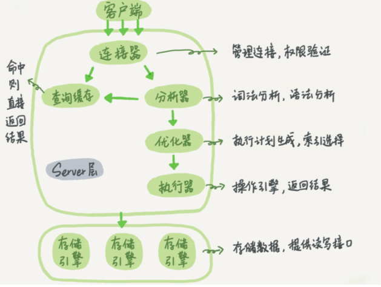

*  目录
{:toc}
## mysql

#### 整体分析




```
服务层：
1 功能维度：
		函数，存储过程 触发器 视图
2 模块划分 
		管理连接 权限验证  。解决长连接内存涨得很快，1 定期断开 2  >=5.7,可以使用mysql_reset_connection，重联，但不需要鉴权
		语法 词法分析
		查询缓存 不推荐使用，表中有更新，所有缓存失效。8.0版本已删除
		优化  执行计划生成 索引选择 
		执行 操作引擎 
		
引擎层 提供数据读写的接口
```

#### 数据库自增主键

#### 数据结构

####  数据库的原子 一致 持久 隔离及实现原理

#### 日志 binlog redo log

#### 锁

#### 索引

#### order by原理

#### count(*)原理


