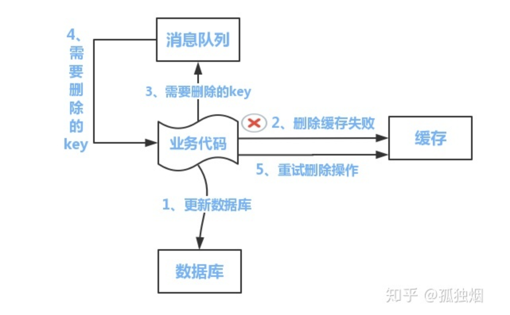
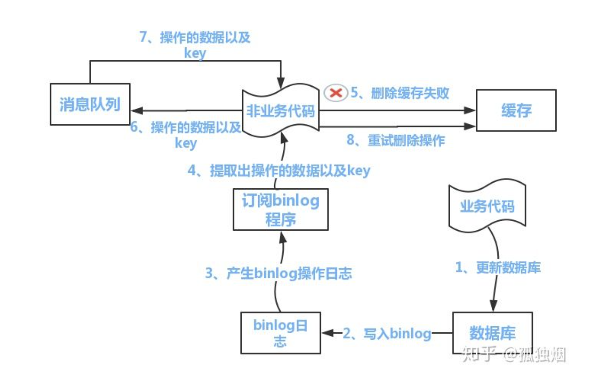
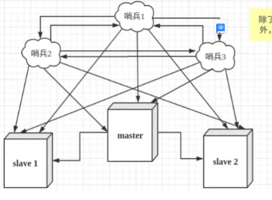
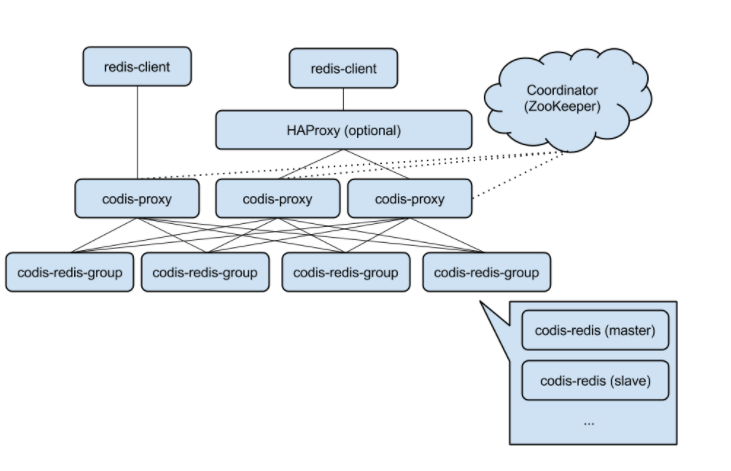
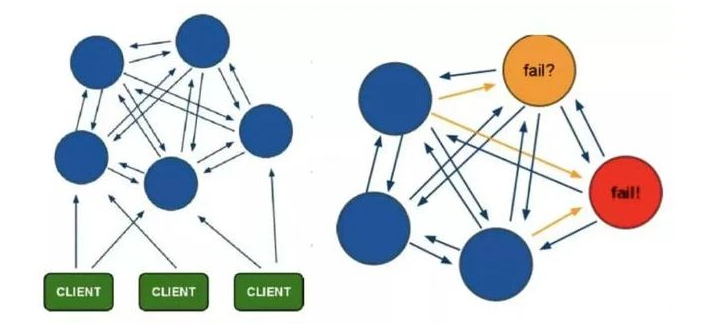

## redis相关

[redis官方教程](http://doc.redisfans.com/ )

### 1 redis基础

##### redis和memcache的区别

```
1 redis 支持多种数据结构，memcache 只支持key-value，memcache可以存储图片视频
2 redis支持持久化 ，memcache不支持
```


##### redis

```
1 ansi c语言编写
2 遵守BSD协议的key-value内存数据库
3 支持持久化
4 官网读11w次/S  写 8w次/S
5 处理用户请求还是单线程。处理unlink删除 大key  rdb持久化用后台线程
```

##### redis6特性

```
1 多线程处理io。
2 客户端缓存
3 acl权限控制 分用户，可以给用户分配数据权限
4 RESP3协议 redis 客户端和服务端之间的协议  -目的-->1 为客户端提供更多功能 2 实现客户端缓存  
5 提升RDB 日志加载速度
6 redis集群代理模块 
```

##### redis应用场景

```
1 高并发替代mysql
2 热点数据缓存
3 消息订阅发布
4 高频读/低频写的数据场景 --排行榜/购物车/字典数据
5 分布式锁
6 快速实现交并差运算
```

##### redis-string基本命令

```
1 get/set  set 如果key存在，即覆盖
2 getset 没有旧值返回nil，有则返回旧值 
3 mget/mset 批量获取/设置 
4 setnx(set if not exists)  存在返回0  失败 ，不存在返回1 成功 
5 incr  会对之前的值+1 eg set key 1 ; INCR KEY ; 此时key的值为2 
```

##### redis-list基本命令

```
1 最多存放2^32 40亿数据
2 rpush 在队尾插入新数据
	lpush 在队首插入新数据
	lrange 获取队列数据
	rpop lpop 从最右侧/左侧弹出数据
```

##### redis-set 无序集合-唯一

##### 扩展功能 lua脚本 pipeline pub/sub geospatial heperLoglog 布隆过滤器 

##### 卡槽设计

##### 缓存一致性问题

```
1 解决缓存一致性问题 
延迟双删 
1 先删缓存 
2更新数据库 
3根据业务sleep(1)-目的 就是确保读请求结束，写请求可以删除读请求造成的缓存脏数据。 
4 删除缓存
```

问题 后面删除缓存都可能失败 

补偿1  通过业务代码和消息队列做补偿



补偿2 通过binlog做补偿



### 2 持久化

RDB-全量二进制备份

```
1 dump.rdb文件 
2 触发rdb四种方式 
	save 阻塞redis其他处理命令
	bgsave fork子进程处理，不会阻塞
	自动化触发通过配置完成 save m n 在m秒内数据集存在n次修改时 自动触发 bgsave
	主从架构，在服务器数据同步时，发送sync ，master主服务器会执行bgsave
	
3 优缺点 
优点 1 rdb文件紧凑 全量备份 2 恢复比aof快 3 rdb文件是紧凑压缩的二进制文件 
缺点：1 全量备份子进程存在开销 2 可能丢失数据

扩展 
文件存放路径 /usr/LOACL/REDIS/DATA
持久化策略 
save 3600 1 
save 300 100 
save 60 10000
导出是否压缩字符串和对象 默认是yes  rdbcompression yes
导入是否检查 
rdbchecksum yes
```

### 3 分布式锁实现 

```
redis 作为分布式锁的相关命令
lock ，setnx expire 用lua脚本保证这2个命令的原子性，防止setnx成功，过期时间没有成功
unlock del key 解锁是删除key

单机redis问题 
1 单机不具备高可用
2 集群场景下，如果A在master拿到了锁,在没有把数据同步到slave时，master挂掉了。B再拿锁就会从slave拿锁，而且会拿到。又出现了两个线程同时拿到锁。

```

##### 集群同步延迟问题

用于redis的服务肯定不能是单机，因为单机就不是高可用了，一量挂掉整个分布式锁就没用了。
在集群场景下，如果A在master拿到了锁,在没有把数据同步到slave时，master挂掉了。B再拿锁就会从slave拿锁，而且会拿到。又出现了两个线程同时拿到锁。
基于以上的考虑，Redis 的作者也考虑到这个问题，他提出了一个 RedLock 的算法。
这个算法的意思大概是这样的：假设 Redis 的部署模式是 Redis Cluster，总共有 5 个 Master 节点。
通过以下步骤获取一把锁：

- 获取当前时间戳，单位是毫秒。
- 轮流尝试在每个 Master 节点上创建锁，过期时间设置较短，一般就几十毫秒。
- 尝试在大多数节点上建立一个锁，比如 5 个节点就要求是 3 个节点（n / 2 +1）。
- 客户端计算建立好锁的时间，如果建立锁的时间小于超时时间，就算建立成功了。
- 要是锁建立失败了，那么就依次删除这个锁。
- 只要别人建立了一把分布式锁，你就得不断轮询去尝试获取锁。

但是这样的这种算法还是颇具争议的，可能还会存在不少的问题，无法保证加锁的过程一定正确。
这个问题的根本原因就是redis的集群属于AP，分布式锁属于CP，用AP去实现CP是不可能的。

##### Redisson

```
Redisson通过lua脚本解决了上面的原子性问题，
通过“看门狗”解决了续约问题，
但是它应该解决不了集群中的同步延迟问题。
```

redis集群 setnx 会有哪些问题

### 4 集群部署模式

##### 主从复制

原理

```sequence
从服务器-->主服务器:SYNC请求
主服务器-->主服务器:bgsave创建快照，缓冲快照
主服务器-->从服务器:1 同步快照
从服务器-->从服务器:解析载入快照
主服务器-->从服务器:2 同步写缓冲
从服务器-->从服务器:载入缓冲
主服务器-->从服务器:3 同步增量
```

主从复制优缺点

```
优点
1 主自动同步数据到从，方便读写分离
2 主从同步都为异步，对主服务器和从服务不影响

缺点
1 不具备自动容错和恢复的功能，需要人工介入
2 主机延吉，切换ip后，会有数据不一致问题。
3 slave断线，需用重启，不能同事批量重启，会导致主服务器IO资源紧张
```


##### 哨兵模式

部署图



哨兵模式

```
哨兵的资料 http://doc.redisfans.com/topic/sentinel.html
客户端连接：通过sentinel client 连接 

redis哨兵的功能 
1 监控 通过ping pong 命令
2 提醒 当发现redis服务异常，通过api向管理员或其他应用程序发送通知
3 故障转移 当主服服务器失效是，让从服务器升级为主服务器，让其他的从服务器复制新的主服务器。给客户端返回新的服务器地址

选举过程  超过半数的sentinel 同意才会执行故障转移

主观下线：一个sentinel认为服务器下线
客观下线：多个sentinel 认为服务器下线，并相互做出交流后，得出服务器下线的判断--只使用主服务器

故障转移的过程

发现主服务器已经进入客观下线状态。
对我们的当前纪元进行自增（详情请参考 Raft leader election ）， 并尝试在这个纪元中当选。
如果当选失败， 那么在设定的故障迁移超时时间的两倍之后， 重新尝试当选。 如果当选成功， 那么执行以下步骤。
选出一个从服务器，并将它升级为主服务器。
向被选中的从服务器发送 SLAVEOF NO ONE 命令，让它转变为主服务器。
通过发布与订阅功能， 将更新后的配置传播给所有其他 Sentinel ， 其他 Sentinel 对它们自己的配置进行更新。
向已下线主服务器的从服务器发送 SLAVEOF 命令， 让它们去复制新的主服务器。
当所有从服务器都已经开始复制新的主服务器时， 领头 Sentinel 终止这次故障迁移操作。

Sentinel 使用以下规则来选择新的主服务器：

在失效主服务器属下的从服务器当中， 那些被标记为主观下线、已断线、或者最后一次回复 PING 命令的时间大于五秒钟的从服务器都会被淘汰。
在失效主服务器属下的从服务器当中， 那些与失效主服务器连接断开的时长超过 down-after 选项指定的时长十倍的从服务器都会被淘汰。
在经历了以上两轮淘汰之后剩下来的从服务器中， 我们选出复制偏移量（replication offset）最大的那个从服务器作为新的主服务器； 如果复制偏移量不可用， 或者从服务器的复制偏移量相同， 那么带有最小运行 ID 的那个从服务器成为新的主服务器。

缺点 难实现动态扩容
```


##### codis 分布式方案



[codis](https://github.com/CodisLabs/codis)

```

】codis和twemproxy最大的区别有两个：

codis支持动态水平扩展，对client完全透明不影响服务的情况下可以完成增减redis实例的操作；
codis是用go语言写的并支持多线程，twemproxy用C并只用单线程。 后者又意味着：codis在多核机器上的性能会好于twemproxy；codis的最坏响应时间可能会因为GC的STW而变大，不过go1.5发布后会显著降低STW的时间；如果只用一个CPU的话go语言的性能不如C，因此在一些短连接而非长连接的场景中，整个系统的瓶颈可能变成accept新tcp连接的速度，这时codis的性能可能会差于twemproxy。

codis和redis cluster的区别：

redis cluster基于smart client和无中心的设计，client必须按key的哈希将请求直接发送到对应的节点。这意味着：使用官方cluster必须要等对应语言的redis driver对cluster支持的开发和不断成熟；client不能直接像单机一样使用pipeline来提高效率，想同时执行多个请求来提速必须在client端自行实现异步逻辑。 而codis因其有中心节点、基于proxy的设计，对client来说可以像对单机redis一样去操作proxy（除了一些命令不支持），还可以继续使用pipeline并且如果后台redis有多个的话速度会显著快于单redis的pipeline。同时codis使用zookeeper来作为辅助，这意味着单纯对于redis集群来说需要额外的机器搭zk，不过对于很多已经在其他服务上用了zk的公司来说这不是问题：）

Codis 由四部分组成:
Codis Proxy (codis-proxy)，处理客户端请求，支持Redis协议，因此客户端访问Codis Proxy跟访问原生Redis没有什么区别；
Codis Dashboard (codis-config)，Codis 的管理工具，支持添加/删除 Redis 节点、添加/删除 Proxy 节点，发起数据迁移等操作。codis-config 本身还自带了一个 http server，会启动一个 dashboard，用户可以直接在浏览器上观察 Codis 集群的运行状态；
Codis Redis (codis-server)，Codis 项目维护的一个 Redis 分支，基于 2.8.21 开发，加入了 slot 的支持和原子的数据迁移指令；
ZooKeeper/Etcd，Codis 依赖 ZooKeeper 来存放数据路由表和 codis-proxy 节点的元信息，codis-config 发起的命令都会通过 ZooKeeper 同步到各个存活的 codis-proxy；

Codis 采用 Pre-sharding 的技术来实现数据的分片，默认分成 1024 个 slots (0-1023)，对于每个key来说，通过以下公式确定所属的 Slot Id：

SlotId = crc32(key) % 1024
每一个 slot 都会有一个且必须有一个特定的 server group id 来表示这个 slot 的数据由哪个 server group 来提供。数据的迁移也是以slot为单位的。
```

##### Cluster 集群模式（Redis官方）



集群模式

```
集群特点:任何节点都是相互联通的
redis集群的分片：没有使用一致性hash 引入hash slot 16384  通过key crc16校验后 对16384 取模 来决定哪个槽
cluster;管理集群的插件，通过key算出槽，判断在个节点上

```

##### redis同城双活

```

```

#### 5 大key

##### 大key 大小和数量上

```
单key大小
Redis限制每个String类型value大小不超过512MB， 实际开发中，不要超过10KB，
否则会对CPU和网卡造成极大负载。 hash、list、set、zset元素个数不要超过5000。
理论上限: 每个hashset里头元素数量< 2^32. key的数量 官方评测： 单实例2.5亿 理论上限: 32位，2^32。约40亿
怎么检测 1 bigkeys 2 用脚本迭代 scan key  3 通过dump rdb文件分析大key 
怎么解决：Redis 4.0及之后版本：您可以通过UNLINK命令安全地删除大Key甚至特大Key，该命令能够以非阻塞的方式，逐步地清理传入的Key。 Redis 4.0之前的版本：建议先通过SCAN命令读取部分数据，然后进行删除，避免一次性删除大量key导致Redis阻塞。

危害;内存空间不均匀，操作耗时，网络阻塞

```

### redis常见问题100问

##### 1、Redis 是什么？

##### 2、redis和mecached的区别，以及使用场景

##### 7、Redis 跟 MySQL 缓存一致性

https://zhuanlan.zhihu.com/p/59167071

##### 8、Redis 的几个基本数据类型，底层实现

https://zhuanlan.zhihu.com/p/344918922

##### 9、Redis 为什么那么快

- https://zhuanlan.zhihu.com/p/160157573
- https://xie.infoq.cn/article/b3816e9fe3ac77684b4f29348

##### 10、Redis 中常见集群部署情况，出现性能问题如何排查。

https://mp.weixin.qq.com/s/q79ji-cgfUMo7H0p254QRg

##### 11、Redis 中的事务。

https://mp.weixin.qq.com/s/Hevg_4YJT_PzVd1Z_yE1TQ

##### 12、缓存雪崩、击穿、穿透

https://mp.weixin.qq.com/s/_StOUX9Nu-Bo8UpX7ThZmg

##### 13、Redis 的持久化

https://mp.weixin.qq.com/s/yP2HH8840OMY4e7tKMymiA

##### 14、Redis不是号称单线程也有很高的性能么？为啥还需要多线程？

https://mp.weixin.qq.com/s/SYUYvKCxsyMbdBsRrJOZqA

##### 15、Redis 过期策略和内存淘汰机制

https://segmentfault.com/a/1190000023060522

##### 16、Redis 分布式锁怎么用？有什么问题？

https://mp.weixin.qq.com/s/IoDPieqgY995cyyWAQrQew

##### 17、Redis为什么变慢了？一文讲透如何排查Redis性能问题

https://mp.weixin.qq.com/s/Qc4t_-_pL4w8VlSoJhRDcg


