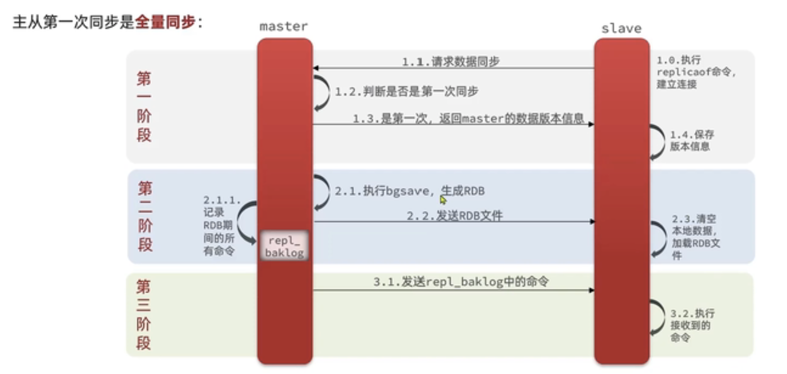

\### 欧科云链

\1. 项目介绍，遇到过什么问题，是如何解决的？

```
concurreent hashmap 扩容

aqs 节点状态
```

\2. ConcurrentHashMap原理？

```
加锁的hashmap +cas+sync对头节点加锁

node 的节点 
static class Node<K,V> implements Map.Entry<K,V> {
        final int hash;
        final K key;
        volatile V val;
        volatile Node<K,V> next;

读不需要加锁 直接读 因为值是volatile修饰的

写知识写数组cas 写链表树 对头节点加锁
```

\3. Semaphore、CountDownLatch源码有读过吗？原理是什么？ 

```
基于AQS

           volatile Node prev;       
           volatile Node next;       // visibly nonnull when signallable
           Thread waiter;            // visibly nonnull when enqueued 当前线程
           volatile int status;  //
共享 独占 int初始化的值不同共享初始化 n 独占初始化 0

公平和非公平  公平实现  进入队列 排队获取锁， 非公平   先获取锁，获取不到进入队列
```

\4. ES有使用过吗？ES为什么那么快？除了倒排索引还有哪些原因？

```
倒排索引
根据文本进行分词，根据词做索引并且关联原句
```

\5. kafka为什么这么快，如何保证消息不丢失，使用多partition时，如何保证消息顺序？如果多线程消费消息，如何保证消费顺序？

\6. kafka有哪些情况会导致rebalance？谈谈你的理解

\7. zookeeper原理，Zab协议

\8. 分布式锁如何实现？分布式事务如何保证？

\9. redis有哪些数据结构？hash实现原理是什么？zset使用什么数据结构实现，原理是什么？跳表的时间复杂度是多少？ logn

```
string 
ziplist
skiplist
hash

ziplist :压缩链表，压缩成二进制 按位取元素 插入和删除平均是O(n)

zset
ziplist：满足以下两个条件的时候元素数量少于128的时候每个元素的长度小于64字节skiplist：不满足上述两个条件就会使用跳表，具体来说是组合了map和skiplistmap用来存储member到score的映射，这样就可以在O(1)时间内找到member对应的分数skiplist按从小到大的顺序存储分数skiplist每个元素的值都是[score,value]对

redis 大key的危害
redis单线程 大key 如果并频繁读取的 会导致io阻塞，严重影响redis性能

```

\10. redis集群是怎么部署的？如何实现高可用

```
哨兵 +cluster
主从  问题 不能实现故障转移 集群监控
哨兵   
cluster  解决海量数据 高并发读写 前两者都不能实现
```

##### redis主从同步



\11. mysql索引使用哪种数据结构实现？B+树存储哪些数据，与B树有什么区别？

\12. mysql事务隔离级别

\13. mysql索引注意事项？如何查看执行计划，需要关注哪些信息？

\14. mysql如何实现主从同步，binlog、redo log、undo log区别

\15. 分享个工作中印象比较深刻的case，遇到了什么问题，如何解决

\16. 关于安全性，项目中有哪些考虑，如何实现的

sql预编译 权限控制 

\17. 处理过线上问题吧，如何发现问题并处理的？有没有jvm调优经验，什么时候会进行垃圾回收？栈会进行垃圾回收吗？

\18. 项目中使用的什么技术栈，有没有看过其中源码？springboot有自己写过starter吗？ioc容器是如何初始化的？

```

```

\19. 都有关注过哪些中间件源码？讲解下原理

\20. tomcat启动时，想要进行一些自定义操作，比如实现自定义组件，如何实现？

```
ServletContainerInitializer实现这个类
```

\21. dubbo是怎样实现服务化的

```
分包, 粒度, 版本, 兼容性, 枚举, 序列化, 异常
```

\22. 有使用过线程池吗？在哪些场景下应用的，是如何进行工作的？有什么注意事项？


\23. 有哪些方法可以实现线程等待？

```
锁 join wait sleep 
```

\24. 实现可见性的方式有哪些？volatile是如何实现可见性的？

```
加锁
```

\25. mysql索引会影响读写性能吗？是如何影响的？

```
索引有助于提升数据的查询性能。对于B+树，查询数据的IO平均次数为O(log n)；如果没有索引需要逐条匹配，IO平均次数为O(n)。
　索引会影响数据库的写性能。因为B+树是一颗多路平衡查找树，数据的插入和删除都可能导致B+树重新平衡，特别对于聚集索引，还可能导致数据的迁移。
　
```

\26. 对于以后工作的规划？自己有哪些优势