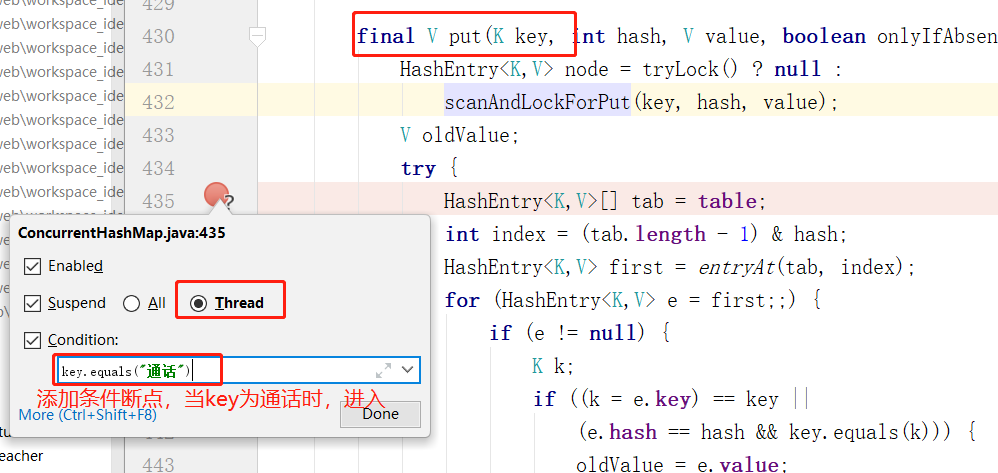
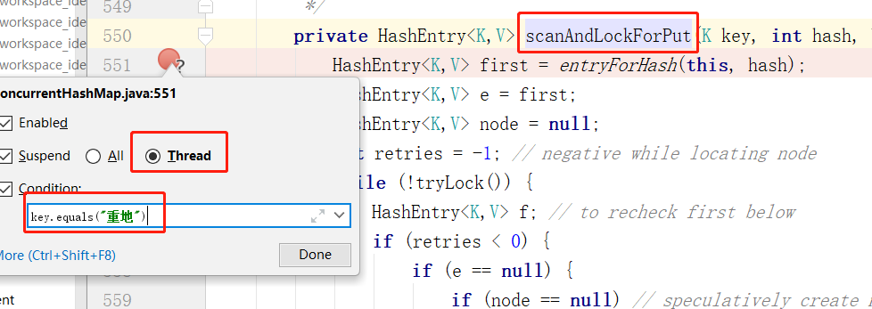
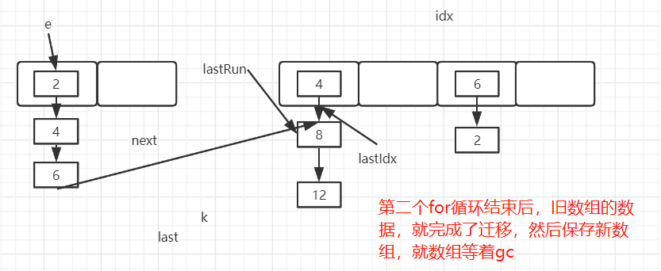

## ConcurrentHashMap源码分析（一）

### 一、Unsafe介绍

#### 1、Unsafe简介

Unsafe类相当于是一个java语言中的后门类，**提供了硬件级别的原子操作**，所以在一些并发编程中被大量使用。jdk已经作出说明，该类对程序员而言不是一个安全操作，在后续的jdk升级过程中，可能会禁用该类。所以这个类的使用是一把双刃剑，实际项目中谨慎使用，以免造成jdk升级不兼容问题。

#### 2、Unsafe Api

这里并不系统讲解Unsafe的所有功能，只介绍和接下来内容相关的操作

`arrayBaseOffset`：获取数组的基础偏移量

`arrayIndexScale`：获取数组中元素的偏移间隔，要获取对应所以的元素，将索引号和该值相乘，获得数组中指定角标元素的偏移量

`getObjectVolatile`：获取对象上的属性值或者数组中的元素

`getObject`：获取对象上的属性值或者数组中的元素，已过时

`putOrderedObject`：设置对象的属性值或者数组中某个角标的元素，更高效

`putObjectVolatile`：设置对象的属性值或者数组中某个角标的元素

`putObject`：设置对象的属性值或者数组中某个角标的元素，已过时

#### 3、代码演示

```java
public class Test02 {

    public static void main(String[] args) throws Exception {
        Integer[] arr = {2,5,1,8,10};

        //获取Unsafe对象
        Unsafe unsafe = getUnsafe();
        //获取Integer[]的基础偏移量
        int baseOffset = unsafe.arrayBaseOffset(Integer[].class);
        //获取Integer[]中元素的偏移间隔
        int indexScale = unsafe.arrayIndexScale(Integer[].class);

        //获取数组中索引为2的元素对象
        Object o = unsafe.getObjectVolatile(arr, (2 * indexScale) + baseOffset);
        System.out.println(o); //1

        //设置数组中索引为2的元素值为100
        unsafe.putOrderedObject(arr,(2 * indexScale) + baseOffset,100);

        System.out.println(Arrays.toString(arr));//[2, 5, 100, 8, 10]
    }

    //反射获取Unsafe对象
    public static Unsafe getUnsafe() throws Exception {
        Field theUnsafe = Unsafe.class.getDeclaredField("theUnsafe");
        theUnsafe.setAccessible(true);
        return (Unsafe) theUnsafe.get(null);
    }
}
```

##### 3.1、图解说明


### 二、jdk1.7容器初始化

#### 1、源码解析

> 无参构造

```java
//空参构造
public ConcurrentHashMap() {
    //调用本类的带参构造
    //DEFAULT_INITIAL_CAPACITY = 16
    //DEFAULT_LOAD_FACTOR = 0.75f
    //int DEFAULT_CONCURRENCY_LEVEL = 16
    this(DEFAULT_INITIAL_CAPACITY, DEFAULT_LOAD_FACTOR, DEFAULT_CONCURRENCY_LEVEL);
}
```

> 三个参数的构造：一些非核心逻辑的代码已经省略

```java
//initialCapacity 定义ConcurrentHashMap存放元素的容量
//concurrencyLevel 定义ConcurrentHashMap中Segment[]的大小
public ConcurrentHashMap(int initialCapacity,
                         float loadFactor, int concurrencyLevel) {
   
    int sshift = 0;
    int ssize = 1;
    //计算Segment[]的大小，保证是2的幂次方数
    while (ssize < concurrencyLevel) {
        ++sshift;
        ssize <<= 1;
    }
    //这两个值用于后面计算Segment[]的角标
    this.segmentShift = 32 - sshift;
    this.segmentMask = ssize - 1;
    
    //计算每个Segment中存储元素的个数
    int c = initialCapacity / ssize;
    if (c * ssize < initialCapacity)
        ++c;
    //最小Segment中存储元素的个数为2
    int cap = MIN_SEGMENT_TABLE_CAPACITY;
    ////矫正每个Segment中存储元素的个数，保证是2的幂次方，最小为2
    while (cap < c)
        cap <<= 1;
    //创建一个Segment对象，作为其他Segment对象的模板
    Segment<K,V> s0 =
        new Segment<K,V>(loadFactor, (int)(cap * loadFactor),
                         (HashEntry<K,V>[])new HashEntry[cap]);
    Segment<K,V>[] ss = (Segment<K,V>[])new Segment[ssize];
    //利用Unsafe类，将创建的Segment对象存入0角标位置
    UNSAFE.putOrderedObject(ss, SBASE, s0); // ordered write of segments[0]
    this.segments = ss;
}
```

> 综上：ConcurrentHashMap中保存了一个**默认长度为16的Segment[]**，每个Segment元素中保存了一个**默认长度为2的HashEntry[]**，我们添加的元素，是存入对应的Segment中的HashEntry[]中。所以ConcurrentHashMap中默认元素的长度是32个，而不是16个

#### 2、图解


#### 3、Segment是什么？

```java
static final class Segment<K,V> extends ReentrantLock implements Serializable {
	...
}
```

> 我们发现Segment是继承自ReentrantLock的，学过线程的兄弟都知道，它可以实现同步操作，从而保证多线程下的安全。因为每个Segment之间的锁互不影响，所以我们也将ConcurrentHashMap中的这种锁机制称之为**分段锁**，这比HashTable的线程安全操作高效的多。

#### 4、HashEntry是什么？

```java
//ConcurrentHashMap中真正存储数据的对象
static final class HashEntry<K,V> {
    final int hash; //通过运算，得到的键的hash值
    final K key; // 存入的键
    volatile V value; //存入的值
    volatile HashEntry<K,V> next; //记录下一个元素，形成单向链表

    HashEntry(int hash, K key, V value, HashEntry<K,V> next) {
        this.hash = hash;
        this.key = key;
        this.value = value;
        this.next = next;
    }
}
```

### 三、jdk1.7添加安全

#### 1、源码分析

##### 1.1、ConcurrentHashMap的put方法

```java
public V put(K key, V value) {
    Segment<K,V> s;
    if (value == null)
        throw new NullPointerException();
    //基于key，计算hash值
    int hash = hash(key);
    //因为一个键要计算两个数组的索引，为了避免冲突，这里取高位计算Segment[]的索引
    int j = (hash >>> segmentShift) & segmentMask;
    //判断该索引位的Segment对象是否创建，没有就创建
    if ((s = (Segment<K,V>)UNSAFE.getObject          // nonvolatile; recheck
         (segments, (j << SSHIFT) + SBASE)) == null) //  in ensureSegment
        s = ensureSegment(j);
    //调用Segmetn的put方法实现元素添加
    return s.put(key, hash, value, false);
}
```

##### 1.2、ConcurrentHashMap的ensureSegment方法

```JAVA
//创建对应索引位的Segment对象，并返回
private Segment<K,V> ensureSegment(int k) {
    final Segment<K,V>[] ss = this.segments;
    long u = (k << SSHIFT) + SBASE; // raw offset
    Segment<K,V> seg;
    //获取，如果为null，即创建
    if ((seg = (Segment<K,V>)UNSAFE.getObjectVolatile(ss, u)) == null) {
        //以0角标位的Segment为模板
        Segment<K,V> proto = ss[0]; // use segment 0 as prototype
        int cap = proto.table.length;
        float lf = proto.loadFactor;
        int threshold = (int)(cap * lf);
        HashEntry<K,V>[] tab = (HashEntry<K,V>[])new HashEntry[cap];
        //获取，如果为null，即创建
        if ((seg = (Segment<K,V>)UNSAFE.getObjectVolatile(ss, u))
            == null) { // recheck
            //创建
            Segment<K,V> s = new Segment<K,V>(lf, threshold, tab);
            //自旋方式，将创建的Segment对象放到Segment[]中，确保线程安全
            while ((seg = (Segment<K,V>)UNSAFE.getObjectVolatile(ss, u))
                   == null) {
                if (UNSAFE.compareAndSwapObject(ss, u, null, seg = s))
                    break;
            }
        }
    }
    //返回
    return seg;
}
```

##### 1.3、Segment的put方法

```java
final V put(K key, int hash, V value, boolean onlyIfAbsent) {
    //尝试获取锁，获取成功，node为null，代码向下执行
    //如果有其他线程占据锁对象，那么去做别的事情，而不是一直等待，提升效率
    //scanAndLockForPut 稍后分析
    HashEntry<K,V> node = tryLock() ? null :
        scanAndLockForPut(key, hash, value);
    V oldValue;
    try {
        HashEntry<K,V>[] tab = table;
        //取hash的低位，计算HashEntry[]的索引
        int index = (tab.length - 1) & hash;
        //获取索引位的元素对象
        HashEntry<K,V> first = entryAt(tab, index);
        for (HashEntry<K,V> e = first;;) {
            //获取的元素对象不为空
            if (e != null) {
                K k;
                //如果是重复元素，覆盖原值
                if ((k = e.key) == key ||
                    (e.hash == hash && key.equals(k))) {
                    oldValue = e.value;
                    if (!onlyIfAbsent) {
                        e.value = value;
                        ++modCount;
                    }
                    break;
                }
                //如果不是重复元素，获取链表的下一个元素，继续循环遍历链表
                e = e.next;
            }
            else { //如果获取到的元素为空
                //当前添加的键值对的HashEntry对象已经创建
                if (node != null)
                    node.setNext(first); //头插法关联即可
                else
                    //创建当前添加的键值对的HashEntry对象
                    node = new HashEntry<K,V>(hash, key, value, first);
                //添加的元素数量递增
                int c = count + 1;
                //判断是否需要扩容
                if (c > threshold && tab.length < MAXIMUM_CAPACITY)
                    //需要扩容
                    rehash(node);
                else
                    //不需要扩容
                    //将当前添加的元素对象，存入数组角标位，完成头插法添加元素
                    setEntryAt(tab, index, node);
                ++modCount;
                count = c;
                oldValue = null;
                break;
            }
        }
    } finally {
        //释放锁
        unlock();
    }
    return oldValue;
}
```

##### 1.4、Segment的scanAndLockForPut方法

> 该方法在线程没有获取到锁的情况下，去完成HashEntry对象的创建，提升效率
>
> 但是这个操作个人感觉有点累赘了。

```java
private HashEntry<K,V> scanAndLockForPut(K key, int hash, V value) {
    //获取头部元素
    HashEntry<K,V> first = entryForHash(this, hash);
    HashEntry<K,V> e = first;
    HashEntry<K,V> node = null；
    int retries = -1; // negative while locating node
    while (!tryLock()) {
        //获取锁失败
        HashEntry<K,V> f; // to recheck first below
        if (retries < 0) {
            //没有下一个节点，并且也不是重复元素，创建HashEntry对象，不再遍历
            if (e == null) {
                if (node == null) // speculatively create node
                    node = new HashEntry<K,V>(hash, key, value, null);
                retries = 0;
            }
            else if (key.equals(e.key))
                //重复元素，不创建HashEntry对象，不再遍历
                retries = 0;
            else
                //继续遍历下一个节点
                e = e.next;
        }
        else if (++retries > MAX_SCAN_RETRIES) {
            //如果尝试获取锁的次数过多，直接阻塞
            //MAX_SCAN_RETRIES会根据可用cpu核数来确定
            lock();
            break;
        }
        else if ((retries & 1) == 0 &&
                 (f = entryForHash(this, hash)) != first) {
            //如果期间有别的线程获取锁，重新遍历
            e = first = f; // re-traverse if entry changed
            retries = -1;
        }
    }
    return node;
}
```

#### 2、模拟多线程的代码流程

> 这里“通话”和“重地”的哈希值是一样的，那么他们添加时，会存入同一个Segment对象，必然会存在锁竞争

```java
public static void main(String[] args) throws Exception {
    final ConcurrentHashMap chm = new ConcurrentHashMap();

    new Thread(){
        @Override
        public void run() {
            chm.put("通话","11");
            System.out.println("-----------");
        }
    }.start();

	//让第一个线程先启动，进入put方法
    Thread.sleep(1000);

    new Thread(){
        @Override
        public void run() {
            chm.put("重地","22");
            System.out.println("===========");
        }
    }.start();
}
```

##### 2.1、多线程环境下的条件断点设置





##### 2.2、运行结果

> 会发现两个线程，分别停在不同的断点位置，这就是多线程锁互斥产生的结果
>
> 然后就可以分别让不同的线程向下执行，查看代码走向了。


### 四、jdk1.7扩容安全

#### 1、源码分析

```java
private void rehash(HashEntry<K,V> node) {
    HashEntry<K,V>[] oldTable = table;
    int oldCapacity = oldTable.length;
    //两倍容量
    int newCapacity = oldCapacity << 1;
    threshold = (int)(newCapacity * loadFactor);
    //基于新容量，创建HashEntry数组
    HashEntry<K,V>[] newTable =
        (HashEntry<K,V>[]) new HashEntry[newCapacity];
    int sizeMask = newCapacity - 1;
   	//实现数据迁移
    for (int i = 0; i < oldCapacity ; i++) {
        HashEntry<K,V> e = oldTable[i];
        if (e != null) {
            HashEntry<K,V> next = e.next;
            int idx = e.hash & sizeMask;
            if (next == null)   //  Single node on list
                //原位置只有一个元素，直接放到新数组即可
                newTable[idx] = e;
            else { // Reuse consecutive sequence at same slot
                //=========图一=====================
                HashEntry<K,V> lastRun = e;
                int lastIdx = idx;
                for (HashEntry<K,V> last = next;
                     last != null;
                     last = last.next) {
                    int k = last.hash & sizeMask;
                    if (k != lastIdx) {
                        lastIdx = k;
                        lastRun = last;
                    }
                }
                //=========图一=====================
                
                //=========图二=====================
                newTable[lastIdx] = lastRun;
                //=========图二=====================
                // Clone remaining nodes
                //=========图三=====================
                for (HashEntry<K,V> p = e; p != lastRun; p = p.next) {
                    V v = p.value;
                    int h = p.hash;
                    int k = h & sizeMask;
                    HashEntry<K,V> n = newTable[k];
                    //这里旧的HashEntry不会放到新数组
                    //而是基于原来的数据创建了一个新的HashEntry对象，放入新数组
                    newTable[k] = new HashEntry<K,V>(h, p.key, v, n);
                }
                //=========图三=====================
            }
        }
    }
    //采用头插法，将新元素加入到数组中
    int nodeIndex = node.hash & sizeMask; // add the new node
    node.setNext(newTable[nodeIndex]);
    newTable[nodeIndex] = node;
    table = newTable;
}
```

#### 2、图解

> 图一


> 图二


> 图三




### 五、jdk1.7集合长度获取

#### 1、源码分析

```java
public int size() {
    // Try a few times to get accurate count. On failure due to
    // continuous async changes in table, resort to locking.
    final Segment<K,V>[] segments = this.segments;
    int size;
    boolean overflow; // true if size overflows 32 bits
    long sum;         // sum of modCounts
    long last = 0L;   // previous sum
    int retries = -1; // first iteration isn't retry
    try {
        for (;;) {
            //当第5次走到这个地方时，会将整个Segment[]的所有Segment对象锁住
            if (retries++ == RETRIES_BEFORE_LOCK) {
                for (int j = 0; j < segments.length; ++j)
                    ensureSegment(j).lock(); // force creation
            }
            sum = 0L;
            size = 0;
            overflow = false;
            for (int j = 0; j < segments.length; ++j) {
                Segment<K,V> seg = segmentAt(segments, j);
                if (seg != null) {
                    //累加所有Segment的操作次数
                    sum += seg.modCount;
                    int c = seg.count;
                    //累加所有segment中的元素个数 size+=c
                    if (c < 0 || (size += c) < 0)
                        overflow = true;
                }
            }
            //当这次累加值和上一次累加值一样，证明没有进行新的增删改操作，返回sum
            //第一次last为0，如果有元素的话，这个for循环最少循环两次的
            if (sum == last)
                break;
            //记录累加的值
            last = sum;
        }
    } finally {
        //如果之前有锁住，解锁
        if (retries > RETRIES_BEFORE_LOCK) {
            for (int j = 0; j < segments.length; ++j)
                segmentAt(segments, j).unlock();
        }
    }
    //溢出，返回int的最大值，否则返回累加的size
    return overflow ? Integer.MAX_VALUE : size;
}
```
> 说明：市面上很多讲ConcurrentHashMap的源码分析课程，大多都是以营销为目的，并没有完整讲解添加安全和扩容安全，就目前我所知，所有公开课程中，没有任何课程讲解jdk1.8多线程扩容效率的改进方案。