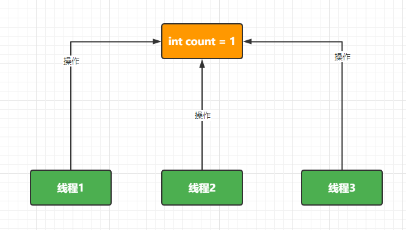

# AQS核心原理及分布式锁的实现

> 讲师：邓澎波老师


# 一、AQS核心原理

AQS是什么？AQS是JDK提供的一个Java类(AbstractQueuedSynchronizer)

AQS的作用是什么？能够帮助我们解决什么问题？---》抽象的同步队列 ---》 数据安全问题

什么是数据安全问题？ --->程序在执行过程中，会有数据流转，数据出现了和我们预期不符的情况，那么就说明数据出问题了！

造成数据安全问题的原因是什么？--》线程，多线程


## 1.数据安全问题

&emsp;&emsp;数据安全问题的根本原因是多线程！



通过代码来演示数据安全问题

```java
public class AQSDemo {

    // 1.定义一个线程间共享操作的资源
    private static Integer count = 0;

    // 2.定义一个操作共享资源的方法
    private static void incr(){
        try {
            Thread.sleep(50);
            count++;
        } catch (InterruptedException e) {
            e.printStackTrace();
        }
    }

    /**
     * 如果数据没有问题结果是1000
     * 然后运行后的结果是一个小于1000的随机值
     * @param args
     * @throws Exception
     */
    public static void main(String[] args) throws Exception{
        // CountDownLatch 这是一个计数器 递减的计数器
        CountDownLatch latch = new CountDownLatch(1000);
        // 循环1000次，创建1000个子线程来操作资源
        for (int i = 0; i < 1000; i++) {
            new Thread(()->{
                incr(); // 操作共享资源
                latch.countDown();// 递减一次
            }).start();
        }
        // 获取1000个子线程执行完成后的count结果
        // 等待1000个子线程执行完成
        // Thread.sleep(10000);
        latch.await(); // 阻塞，等待CountDownLatch 递减到0的时候触发
        System.out.println("count = " + count);
    }
}
```

运行后的结果是一个小于1000的随机值，说明数据出问题了！

造成数据安全问题的原因：

1.可见性

JMM(Java内存模型): volatile synchronized Lock


2.有序性

指令重排序(指令优化) volatile synchronized Lock

```java
int a = funA();
int b = c + d;
```


3.原子性

原子性保证我们的一段代码要么都执行要么都不执行,  AtomicInteger synchronized Lock

```java
int a = 100;
int b = a * c;
int d = b + c + d;
```


通过Lock解决了原子性问题


## 2.自定义解决方案

### 2.1 Lock保证数据安全的原因

Lock中解决数据安全问题的本质其实就是：将并行的操作变为了串行的操作


Lock中实现了哪些功能来保证串行的操作?


### 2.2 自定义Lock

根据上面的分析我们可以看到，要将并行操作转换为串行的操作，那么我们就需要在操作的核心代码的前后添加对应的加锁和释放锁的逻辑。而且应该具备对应的功能

#### 1)  lock方法

1.具有独占性，排他性

```java
int state = 0; // 约定 state==0 表示锁空闲 state > 0 表示锁被占用
if(state == 0){
    state = state + 1;
}else{
    // 锁被占用 阻塞
}
```


2.存储没有抢占到锁的对象

Thread()对象，数组，集合，链表，栈，队列，Tree 等等

3.阻塞没有抢占到锁的线程对象

wait() 阻塞

LockSupport.park() 阻塞


#### 2) unlock方法

1.释放锁

```java
state --;
```


2.唤醒阻塞的线程

notify/notifyAll 唤醒

LockSupport.unpark(); 唤醒


查看源码从探索的状态转变为验证的模式--》难度急剧降低！


## 3.AQS原理

### 3.1 AQS和Lock什么关系？

Lock的具体实现是ReentrantLock

| JUC的API       | 作用         |
| -------------- | ------------ |
| ReentrantLock  | 可重入锁     |
| CountDownLatch | 计数器，递减 |
| CyclicBarrier  | 计数器，递增 |
| Semaphore      | 信号量       |


J.U.C下面的很多的核心的API都是基于AQS来实现的，我们只需要掌握和AQS的核心设计，那么对应的J.U.C包下面的相关的API我们就很容易研究并掌握了！


### 3.2 重入锁

重入锁：同一个对象可以进入该方法的多个加锁的代码,而不出现死锁的情况。


### 3.3 如何实现独占

首先在AQS中定义了一个state变量来控制锁的状态。


在ReentrantLock中默认的实现是非公平锁，加锁的方法实现如下

```java
        final void lock() {
            // 如果state=0就更新为1否则不更新 如果更新返回true否则返回false
            if (compareAndSetState(0, 1))
                // 记录当前锁的拥有者
                setExclusiveOwnerThread(Thread.currentThread());
            else
                acquire(1);
        }
```


面试题：公平锁和非公平锁在AQS中的体现

公平锁：如果有排队的线程，那么会自觉的添加到排队的队列中。


非公平锁：调用lock方法后会直接抢占锁，如果没有抢占到然后才会存储阻塞起来。


### 3.4 如何存储没有抢占到锁的对象

在保证独占性后进入到acquire方法中

```java
    public final void acquire(int arg) {
        if (!tryAcquire(arg)  // 再次尝试获取锁
            &&
            acquireQueued( // 阻塞
                addWaiter(Node.EXCLUSIVE), arg) // 存储没有抢占到锁的方法
           )
            selfInterrupt();
    }
```

先查看tryAcquire方法

```java
        final boolean nonfairTryAcquire(int acquires) {
            // 获取当前的线程对象
            final Thread current = Thread.currentThread();
            // 获取锁的状态
            int c = getState();
            // 锁空闲了
            if (c == 0) {
                // 尝试获取锁
                if (compareAndSetState(0, acquires)) {
                    setExclusiveOwnerThread(current);
                    return true;
                }
            }// 锁被占用  重入  同一个对象再次进入到锁的方法
            else if (current == getExclusiveOwnerThread()) {
                int nextc = c + acquires; // state + 1
                if (nextc < 0) // overflow
                    throw new Error("Maximum lock count exceeded");
                setState(nextc);// 更新锁的状态 state 0 1 2 3 4 ....
                return true;
            }
            return false;
        }
```


然后我们就可以来查看addWaiter方法：

```java
    private Node addWaiter(Node mode) {
        // 创建一个Node对象并保存了当前的线程对象
        Node node = new Node(Thread.currentThread(), mode);
        // Try the fast path of enq; backup to full enq on failure
        // tail 第一次执行的时候是null
        Node pred = tail;
        if (pred != null) {
            node.prev = pred;
            if (compareAndSetTail(pred, node)) {
                pred.next = node;
                return node;
            }
        }
        // 第一次执行的时候因为 tail为null 所以会走 enq方法
        enq(node);
        return node;
    }
```


进入enq方法来分析

```java
// node 存储的有当前的线程对象 线程2   
private Node enq(final Node node) {
        for (;;) {
            // 第一次循环tail==null
            Node t = tail;
            if (t == null) { // Must initialize
                // 首先创建了一个Node对象 赋值给 head
                if (compareAndSetHead(new Node()))
                    tail = head; // 让tail也执行了新创建的Node对象，第一次循环后的内存结构如下
            } else {
                node.prev = t;
                if (compareAndSetTail(t, node)) {
                    t.next = node;
                    return t;
                }
            }
        }
    }
```


然后再来查看enq方法中的第二次循环

```java
// node 存储的有当前的线程对象 线程2   
private Node enq(final Node node) {
        for (;;) {
            // 第二次循环tail==node
            Node t = tail;
            if (t == null) { // Must initialize       
                if (compareAndSetHead(new Node()))
                    tail = head; 
            } else { // 第二次循环
                node.prev = t; // 当前线程的Node节点的前一个节点执行 尾结点
                if (compareAndSetTail(t, node))// 如果t是Tail节点，那么就把node设置为新的tail节点
                {
                    t.next = node; // 原来的尾结点的下一个节点指向了 node节点
                    return t;
                }
            }
        }
    }
```

enq方法中完成了两次循环操作，并在内存中创建了如下的存储结构：


线程2存储起来之后，线程3也因为没有抢占到锁，也进入到了addWaiter方法中，这时我们再来看看逻辑处理。

```java
    private Node addWaiter(Node mode) {
        // 创建了一个记录 线程3的 Node节点
        Node node = new Node(Thread.currentThread(), mode);
        // Try the fast path of enq; backup to full enq on failure
        Node pred = tail; // 此时 tail就不为空了
        if (pred != null) {
            node.prev = pred; // 线程3对应的节点的前置节点是之前的尾结点
            if (compareAndSetTail(pred, node)) {// 如果 pred为尾结点就设置node为新的尾结点
                pred.next = node; // 设置之前的尾结点的下一个节点为线程3对应的节点
                return node;
            }
        }
        enq(node);
        return node;
    }
```


通过上面的逻辑分析我们可以看到。后面如果还有没有抢占到锁的线程都会通过addWaiter方法将给线程对象封装为一个Node对象并添加到队列的尾部


enq方法的作用：只是在addWaiter方法第一次执行的时候完成了 head和tail已经首节的的维护。


### 3.5 如何阻塞的

然后我们来看看AQS中是如何实现阻塞的。

```java
    final boolean acquireQueued(final Node node, int arg) {
        boolean failed = true;
        try {
            boolean interrupted = false;
            for (;;) {
                // 获取当前节点的前置节点
                final Node p = node.predecessor();
                // 当前节点的前置节点是 head 同时获取到了锁
                if (p == head && tryAcquire(arg)) {
                    // 获取到锁之后的操作 --现在我们要讨论的是如何实现阻塞的，这个逻辑之后再看
                    setHead(node);
                    p.next = null; // help GC
                    failed = false;
                    return interrupted;
                }
                if (shouldParkAfterFailedAcquire(p, node) &&
                    parkAndCheckInterrupt())
                    interrupted = true;
            }
        } finally {
            if (failed)
                cancelAcquire(node);
        }
    }
```

先查看整个for循环大的逻辑


对应的流程图


然后具体来看阻塞的逻辑

```java
 final boolean acquireQueued(final Node node, int arg) {
        boolean failed = true;
        try {
            boolean interrupted = false;
            for (;;) {
                // 获取当前节点的前置节点
                final Node p = node.predecessor();
                // 当前节点的前置节点是 head 同时获取到了锁
                if (p == head && tryAcquire(arg)) {
                    // 获取到锁之后的操作 --现在我们要讨论的是如何实现阻塞的，这个逻辑之后再看
                    setHead(node);
                    p.next = null; // help GC
                    failed = false;
                    return interrupted;
                }
                if (shouldParkAfterFailedAcquire(p, node) // 在获取锁失败后是否应该阻塞线程?
                    &&
                    parkAndCheckInterrupt() // 具体实现阻塞的方法
                   )
                    interrupted = true;
            }
        } finally {
            if (failed)
                cancelAcquire(node);
        }
    }
```

具体的阻塞的方法在parkAndCheckInterrupt中

```java
    private final boolean parkAndCheckInterrupt() {
        LockSupport.park(this); // 阻塞了当前的线程
        return Thread.interrupted(); // 在线程被唤醒后 获取线程的状态
    }
```

shouldParkAfterFailedAcquire的作用是给要阻塞的线程的Node节点找到正确的阻塞的位置


如何实现查找阻塞位置的源码分析

AQS中给每个Node都维护了对应的状态


```java
    private static boolean shouldParkAfterFailedAcquire(Node pred, Node node) {
        // 获取前一个节点的状态
        int ws = pred.waitStatus;
        if (ws == Node.SIGNAL) // 如果 waitStatus == -1 表示可以阻塞
            /*
             * This node has already set status asking a release
             * to signal it, so it can safely park.
             */
            return true;
        if (ws > 0) { // 表示前一个节点已经放弃了
            /*
             * Predecessor was cancelled. Skip over predecessors and
             * indicate retry. 前一个节点已经放弃，那么我们就应用继续向前面找 直到找到合适的节点
             */
            do {
                node.prev = pred = pred.prev;
            } while (pred.waitStatus > 0); // 通过循环找到合适的位置
            pred.next = node; // 关联上
        } else {
            /*
             * waitStatus must be 0 or PROPAGATE.  Indicate that we
             * need a signal, but don't park yet.  Caller will need to
             * retry to make sure it cannot acquire before parking. 初始设置节点的状态为 -1 
             */
            compareAndSetWaitStatus(pred, ws, Node.SIGNAL);
        }
        return false;
    }
```

每个节点的初始状态为0，但是当我们有节点需要阻塞的时候，会从0更新为-1.也就是阻塞的状态是-1


### 3.6 怎么释放锁

AQS中的释放锁的逻辑

```java
public final boolean release(int arg) {
    if (tryRelease(arg)) { // 尝试释放锁
        Node h = head;
        if (h != null && h.waitStatus != 0)
            unparkSuccessor(h);
        return true;
    }
    return false;
}
```

然后就进入tryRelease方法中查看

```java
protected final boolean tryRelease(int releases) {
    // 获取State并-1
    int c = getState() - releases;
    if (Thread.currentThread() != getExclusiveOwnerThread())
        // 非法操作
        throw new IllegalMonitorStateException();
    boolean free = false; // 记录释放的状态
    if (c == 0) { // c != 0 表示什么情况?  重入锁的情况
        free = true; // 表示释放成功
        // 清空记录的锁的拥有者对象
        setExclusiveOwnerThread(null);
    }
    setState(c);
    return free;
}
```


### 3.7 如何唤醒线程

唤醒线程继续在源码中找答案

```java
public final boolean release(int arg) {
    if (tryRelease(arg)) {// 表示释放锁成功
        // 尝试唤醒阻塞的线程
        Node h = head;
        if (h != null && h.waitStatus != 0)
            unparkSuccessor(h);// 唤醒阻塞的线程
        return true;
    }
    return false;
}
```

然后进入到unparkSuccessor方法中

```java
private void unparkSuccessor(Node node) {
        /*
         * If status is negative (i.e., possibly needing signal) try
         * to clear in anticipation of signalling.  It is OK if this
         * fails or if status is changed by waiting thread.
         */
        int ws = node.waitStatus;
        if (ws < 0)
            compareAndSetWaitStatus(node, ws, 0);

        /*
         * Thread to unpark is held in successor, which is normally
         * just the next node.  But if cancelled or apparently null,
         * traverse backwards from tail to find the actual
         * non-cancelled successor.
         */
        Node s = node.next;
        if (s == null || s.waitStatus > 0) {
            s = null;
            for (Node t = tail; t != null && t != node; t = t.prev)
                if (t.waitStatus <= 0)
                    s = t;
        }
        if (s != null) // 找到要唤醒的节点
            LockSupport.unpark(s.thread); // 唤醒对应的线程
    }
```

假设我们唤醒的是线程2，那么接下来我们应该要走的逻辑是 park方法的位置


然后我们来看看获取到锁之后的操作


通过图来演示


# 二、分布式锁的实现方式

## 1.MySQL数据库


## 2.Redis


## 3.Zookeeper


# 三、Zookeeper实现分布式锁

## 1.Zookeeper基础内容


## 2.Zookeeper分布式锁


# 四、Redis实现分布式锁


## 1.Redis基础


## 2.Redis分布式锁


